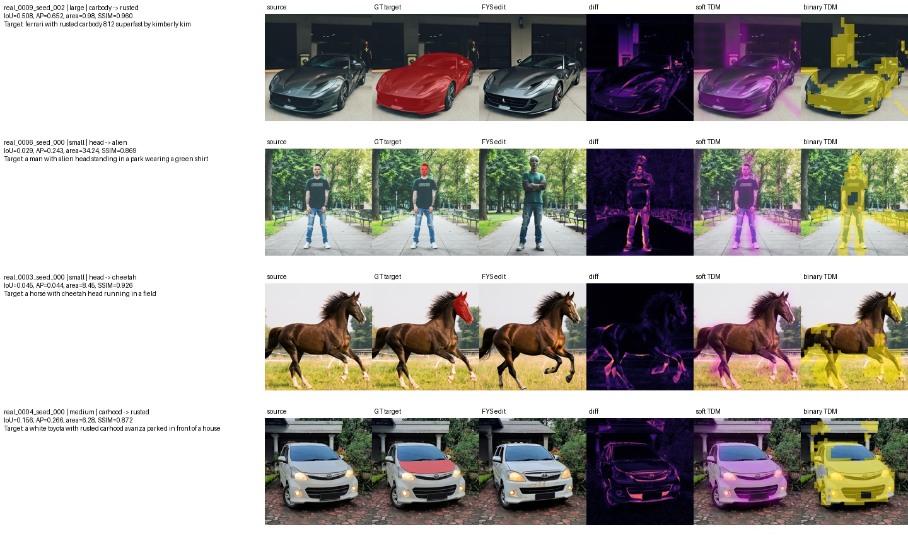

# Part-Level TDM Localization in Follow-Your-Shape

This repository contains a controlled diagnostic study for Harry Yang's feedback on controllable image editing. The question is narrow:

> When a prompt asks for a local part-level edit inside an object, does Follow-Your-Shape's trajectory divergence map (TDM) localize the intended part, or does it expand to a broader object/background region?

The final controlled revision uses PartEdit-Bench cases with ground-truth part masks, runs Follow-Your-Shape (FYS) on a fixed balanced subset, and compares FYS-TDM against a simple FLUX target-token attention localization baseline.

## Current Result

The controlled revision uses a fixed 12-case subset:

- 4 small-part cases.
- 4 medium-part cases.
- 4 large-part cases.
- 3 fixed seeds per case: `0, 1, 2`.
- 36 FYS runs and 36 FLUX-attention baseline runs.

Main finding:

> FYS-TDM is a useful edit-localization signal, but for part-level edits it often over-localizes beyond the intended part, especially for small parts. A simple FLUX target-token attention signal is often more spatially concentrated, suggesting that trajectory-divergence localization is too coarse for fine part-level control.

Compact summary:

| Method | Part size | Binary IoU | Soft AP | Predicted / GT area |
|---|---:|---:|---:|---:|
| FYS TDM | large | 0.308 ± 0.138 | 0.371 ± 0.186 | 3.19 ± 1.63 |
| FYS TDM | medium | 0.161 ± 0.066 | 0.225 ± 0.133 | 5.40 ± 2.03 |
| FYS TDM | small | 0.048 ± 0.014 | 0.124 ± 0.086 | 16.98 ± 10.69 |
| FLUX target-token attention | large | 0.425 ± 0.174 | 0.609 ± 0.196 | 2.38 ± 1.26 |
| FLUX target-token attention | medium | 0.267 ± 0.108 | 0.338 ± 0.146 | 3.43 ± 1.14 |
| FLUX target-token attention | small | 0.240 ± 0.276 | 0.501 ± 0.415 | 13.09 ± 15.09 |

The full machine-readable tables are in:

- `core/results/controlled_revision/compact_fys_summary_for_harry.csv`
- `core/results/controlled_revision/localization_comparison_for_harry.csv`
- `core/results/controlled_revision/fys_run_metrics.csv`
- `core/results/controlled_revision/flux_attention_metrics.csv`

## Key Artifacts

- `core/data/partedit_subset/pilot_12_manifest.json`: fixed 12-case subset.
- `core/artifacts/partedit_pilot_12_cases_strict.tar.gz`: portable copy of the selected source images, masks, reference images, and metadata.
- `core/configs/fys_controlled_revision.json`: fixed experiment configuration and pinned FYS submodule revision.
- `core/scripts/run_fys_pilot.py`: FYS batch runner.
- `core/scripts/run_flux_attention_baseline.py`: FLUX target-token attention baseline runner.
- `core/notebooks/03_evaluate_controlled_revision.ipynb`: final evaluation notebook.
- `core/results/run_matrices/`: command/config matrices for FYS and attention runs.
- `core/results/follow_your_shape/`: FYS outputs, logs, configs, and TDM artifacts.
- `core/results/flux_attention_baseline/`: attention maps, logs, and configs.
- `core/results/controlled_revision/`: final metric tables and qualitative review sheets.
- `core/reports/final_note.md`: compact English note for Harry.
- `core/reports/email_to_harry.md`: draft reply email.

Representative result sheet:

<div align="center">
  <a href="core/results/controlled_revision/figures/representative_case_candidates_sheet.jpg">
    
  </a>
  <br>
  <sub>Four representative success/failure cases. Click to open full resolution.</sub>
</div>

Diagnostic sheets:

- `core/results/controlled_revision/figures/manual_scoring_sheet_part1.jpg`
- `core/results/controlled_revision/figures/manual_scoring_sheet_part2.jpg`
- `core/results/controlled_revision/figures/manual_scoring_sheet_part3.jpg`
- `core/results/controlled_revision/figures/tdm_diagnostic_sheet_part1.jpg`
- `core/results/controlled_revision/figures/tdm_diagnostic_sheet_part2.jpg`
- `core/results/controlled_revision/figures/tdm_diagnostic_sheet_part3.jpg`

## Project Layout

- `core/data/`: dataset manifests and portable subset archive.
- `core/configs/`: reproducibility configuration.
- `core/notebooks/`: dataset inspection and final evaluation notebooks.
- `core/scripts/`: FYS and FLUX-attention runners.
- `core/third_party/FollowYourShape/`: pinned Follow-Your-Shape submodule.
- `core/results/`: committed controlled-revision outputs and local runtime outputs.
- `core/reports/`: compact note and email draft.

## Local Analysis Setup

Use `uv` for local notebook analysis:

```bash
uv sync
uv run python -m ipykernel install --user --name part-level-tdm-localization --display-name "part-level-tdm-localization"
uv run jupyter lab
```

Run the final analysis notebook from the project root:

```bash
uv run python -m jupyter nbconvert --execute --to notebook --inplace core/notebooks/03_evaluate_controlled_revision.ipynb
```

The notebook resizes raw patch-grid TDM and attention maps to image resolution only for evaluation and visualization. The raw `.npy` files are not modified.

## Data Preparation

The manifest references `core/data/partedit_subset/cases/<case_uid>/...`. The selected case files are packaged in:

```text
core/artifacts/partedit_pilot_12_cases_strict.tar.gz
```

If the `cases/` directory is missing, unpack it from the project root:

```bash
tar -xzf core/artifacts/partedit_pilot_12_cases_strict.tar.gz
```

This creates the exact 12 selected cases used by the controlled revision.

## GPU Reproduction Guide

Recommended machine:

- One A800/A100/H800 80GB GPU.
- At least 100GB data disk; 150GB+ is safer for first-time FLUX downloads.
- Python 3.10 with a working CUDA PyTorch environment.

Clone with the pinned submodule:

```bash
export WORKDIR=/path/to/data-disk
mkdir -p "$WORKDIR"
cd "$WORKDIR"
git clone --recurse-submodules https://github.com/ptan853/part-level-tdm-localization.git part-level-overediting
cd part-level-overediting
tar -xzf core/artifacts/partedit_pilot_12_cases_strict.tar.gz
```

Set cache directories to a data disk with enough space for FLUX downloads:

```bash
export HF_HOME="$WORKDIR/hf_cache"
export HUGGINGFACE_HUB_CACHE="$HF_HOME/hub"
export TRANSFORMERS_CACHE="$HF_HOME/transformers"
export TORCH_HOME="$WORKDIR/torch_cache"
export PIP_CACHE_DIR="$WORKDIR/pip_cache"
export OMP_NUM_THREADS=8
mkdir -p "$HF_HOME" "$HUGGINGFACE_HUB_CACHE" "$TRANSFORMERS_CACHE" "$TORCH_HOME" "$PIP_CACHE_DIR"
```

If the machine is in mainland China or has slow HuggingFace/PyPI access, optionally set a HuggingFace mirror and a nearby PyPI mirror:

```bash
export HF_ENDPOINT=https://hf-mirror.com
export PIP_INDEX_URL=https://mirrors.aliyun.com/pypi/simple/
```

Login to HuggingFace after accepting the FLUX.1-dev license:

```bash
hf auth login
```

Install project and FYS dependencies. If the base image already has working PyTorch, do not reinstall Torch.

```bash
pip install -e .

cd core/third_party/FollowYourShape
pip install -e ".[all]"
cd ../../..
```

Pin the versions validated in our run with PyTorch `2.1.2+cu118`:

```bash
python -m pip install --force-reinstall \
  "numpy==1.26.4" \
  "opencv-python==4.10.0.84" \
  "transformers==4.44.2" \
  "tokenizers==0.19.1" \
  "diffusers==0.32.2" \
  "huggingface-hub==0.25.2" \
  "seaborn==0.13.2" \
  "scikit-image==0.24.0"
```

Check imports:

```bash
python -c "import torch; import numpy; import cv2; import transformers; import diffusers; print('ok'); print(torch.__version__, torch.cuda.is_available())"
cd core/third_party/FollowYourShape/src
python -c "import flux; from flux.sampling import denoise_with_TDM; print('fys import ok')"
cd ../../..
```

Preview and run FYS:

```bash
python core/scripts/run_fys_pilot.py \
  --manifest core/data/partedit_subset/pilot_12_manifest.json \
  --seeds 0,1,2

python core/scripts/run_fys_pilot.py \
  --manifest core/data/partedit_subset/pilot_12_manifest.json \
  --seeds 0,1,2 \
  --execute
```

Preview and run the FLUX attention baseline:

```bash
python core/scripts/run_flux_attention_baseline.py \
  --manifest core/data/partedit_subset/pilot_12_manifest.json \
  --seeds 0,1,2

python core/scripts/run_flux_attention_baseline.py \
  --manifest core/data/partedit_subset/pilot_12_manifest.json \
  --seeds 0,1,2 \
  --execute
```

Evaluate:

```bash
python -m jupyter nbconvert --execute --to notebook --inplace core/notebooks/03_evaluate_controlled_revision.ipynb
```

## Evaluation Metrics

Localization metrics:

- `binary_iou`: IoU between the predicted binary localization mask and GT part mask.
- `soft_ap`: average precision using the soft localization map as a pixel-level score.
- `pred_to_gt_area_ratio`: predicted binary area divided by GT part area.
- `soft_inside_gt_mass`: fraction of soft localization mass inside the GT part.

Editing and preservation metrics for FYS edited images:

- `human_local_edit_success_0_2`: manual 0-2 rating for whether the requested local edit appears.
- `human_outside_preservation_0_2`: manual 0-2 rating for preservation outside the target part.
- `outside_mask_psnr`, `outside_mask_global_ssim`, `outside_mask_lpips`: preservation outside the GT part mask.

The FLUX attention baseline is a localization-only diagnostic, so image-preservation metrics are `NA` for baseline rows.

## Prompt Choice

The controlled revision uses PartEdit's `p2p_prompt` as the target prompt. This prompt explicitly describes the part-level modification while preserving the source object context, for example:

```text
a dog with bear head standing in a field with grass and water
```

This is preferred over `prompt_changed` because many `prompt_changed` prompts imply full object replacement rather than part-level editing.
