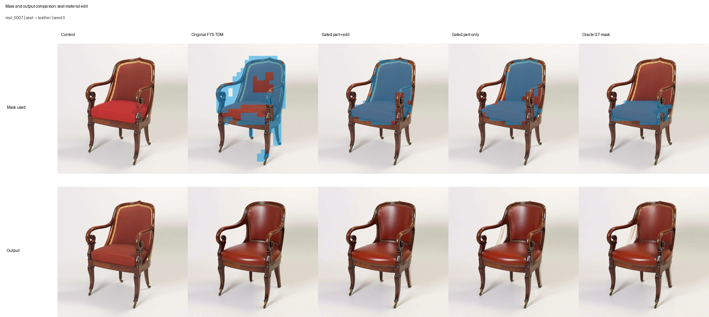

# Part-Level TDM Localization in Follow-Your-Shape

This repository is a small diagnostic study of part-level controllable image editing. The main question is:

> When an edit targets a local object part, does Follow-Your-Shape's trajectory divergence map (TDM) localize the intended part, or does it expand to a broader object/background region?

The experiment uses a fixed PartEdit-Bench subset with ground-truth part masks, runs Follow-Your-Shape (FYS), and compares the original FYS-TDM mask with attention-gated TDM variants.

Start with the compact research note: [`core/reports/final_note.md`](core/reports/final_note.md).

## Key Result

FYS-TDM is useful as an edit-localization signal, but it often over-localizes for part-level edits. Attention-gated TDM substantially improves mask localization, but the final edited image is still limited by the FYS control mechanism: target-prompt trajectory changes can accumulate before the late masked KV-injection stage.

Mask localization against GT part masks:

| Method | Command runs | Unique outputs | Binary IoU ↑ | Soft AP ↑ | Predicted / GT area ↓ |
| --- | ---: | ---: | ---: | ---: | ---: |
| Original FYS-TDM | 36 | 12 | 0.174 | 0.247 | 8.04 |
| Attention-gated FYS, part+edit tokens | 36 | 12 | 0.327 | 0.591 | 2.81 |
| Attention-gated FYS, part-only tokens | 36 | 12 | 0.323 | 0.619 | 2.51 |

Oracle localization is excluded from this table because its projected GT-mask agreement is fixed by construction.

Edited-image preservation outside the GT part mask:

| Method | Outside L1 ↓ | Outside PSNR ↑ | Outside SSIM ↑ | Outside LPIPS ↓ |
| --- | ---: | ---: | ---: | ---: |
| Original FYS-TDM | 0.056 | 20.36 | 0.919 | 0.191 |
| Attention-gated FYS, part+edit tokens | 0.047 | 21.79 | 0.938 | 0.146 |
| Attention-gated FYS, part-only tokens | 0.046 | 22.10 | 0.941 | 0.142 |
| Oracle GT-mask FYS | 0.043 | 22.95 | 0.953 | 0.126 |

Manual review separates semantic edit success from non-target preservation:

| Method | Unique outputs | Local edit success ↑ | Non-target preservation ↑ | Full edits | Full preservation |
| --- | ---: | ---: | ---: | ---: | ---: |
| Original FYS-TDM | 12 | 1.00 | 0.92 | 5 / 12 | 2 / 12 |
| Attention-gated FYS, part+edit tokens | 12 | 1.08 | 1.50 | 5 / 12 | 6 / 12 |
| Attention-gated FYS, part-only tokens | 12 | 1.00 | 1.50 | 5 / 12 | 6 / 12 |
| Oracle GT-mask FYS | 12 | 0.92 | 1.42 | 4 / 12 | 5 / 12 |

The Oracle ablation gives the best automatic preservation but does not improve semantic local-edit success. Localization quality is therefore not the only bottleneck: the timing and scope of FYS's late KV injection also limit part-level control.

The three requested seeds are deterministic for this inversion-based pipeline: the 36 command runs correspond to 12 unique case outputs for each method, so repeated seed rows are not treated as independent samples.

### Latent-State Projection Follow-up

A follow-up oracle-mask study isolates the control operation from mask estimation. During target-prompt denoising, the target state is retained inside the GT part mask while the state outside the mask is projected onto the time-aligned source inversion state. The locked sweep evaluates all 12 cases for projection durations `N=0..13`.

`N=3` gives the strongest observed human-evaluated compromise: local-edit score `1.167/2`, non-target preservation `1.833/2`, and joint success `75.0%`, compared with `41.7%` joint success for Original FYS-TDM. Longer projection further improves non-target L1, PSNR, SSIM, and LPIPS, but can suppress the requested local edit.

See the [latent-state projection duration report](core/reports/latent_projection_duration_study.md) and [Notebook 09](core/notebooks/09_evaluate_latent_projection_duration_sweep.ipynb).

## Visual Examples

The aligned example below shows how original TDM, part+edit gating, part-only gating, and the projected Oracle mask alter both the injection support and generated output. Tighter localization generally makes the result more source-like, but does not monotonically improve the requested semantic edit.

<div align="center">
  <a href="core/results/oracle_mask_eval/figures/mask_output_method_comparison.jpg">
    
  </a>
  <br>
  <sub>Click to open full resolution.</sub>
</div>

The [final note](core/reports/final_note.md#representative-failure-case) separately analyzes the `head -> dragon` cow-road failure, where attention gating and the Oracle mask improve localization but do not recover the requested semantics.

Supporting diagnostic sheets are in:

- `core/results/attention_gated_fys_eval/figures/attention_gated_fys_case_sheet_seed0.jpg`
- `core/results/attention_gated_fys_eval/figures/mask_metric_boxplots.png`
- `core/results/controlled_revision/figures/tdm_diagnostic_sheet_part1.jpg`
- `core/results/controlled_revision/figures/tdm_diagnostic_sheet_part2.jpg`
- `core/results/controlled_revision/figures/tdm_diagnostic_sheet_part3.jpg`

## What Is Included

- `core/data/partedit_subset/pilot_12_manifest.json`: fixed 12-case subset.
- `core/artifacts/partedit_pilot_12_cases_strict.tar.gz`: portable copy of selected images, masks, references, and metadata.
- `core/configs/fys_controlled_revision.json`: fixed experiment configuration and pinned FYS submodule revision.
- `core/scripts/run_fys_pilot.py`: FYS batch runner.
- `core/scripts/run_flux_attention_baseline.py`: FLUX attention baseline runner.
- `core/notebooks/03_evaluate_controlled_revision.ipynb`: final evaluation notebook.
- `core/notebooks/05_evaluate_attention_gated_fys.ipynb`: attention-gated FYS evaluation notebook.
- `core/notebooks/06_evaluate_oracle_mask_ablation.ipynb`: Oracle GT-mask control evaluation notebook.
- `core/notebooks/09_evaluate_latent_projection_duration_sweep.ipynb`: final oracle latent-state projection duration evaluation.
- `core/scripts/run_latent_projection_duration_sweep.py`: locked `N=0..13` control-operation runner.
- `core/scripts/evaluate_latent_projection_against_fys.py`: unified FYS/projection image-metric evaluator.
- `core/results/follow_your_shape/`: FYS edited images, logs, configs, and TDM artifacts.
- `core/results/flux_attention_baseline/`: attention maps, logs, and configs.
- `core/results/controlled_revision/`: final metric tables and qualitative figures.
- `core/results/attention_gated_fys_eval/`: attention-gated FYS metric tables and figures.
- `core/results/oracle_mask_eval/`: Oracle validation, preservation metrics, and comparison figures.
- `core/reports/final_note.md`: compact project note.
- `core/reports/latent_projection_duration_study.md`: final latent-state projection control-operation report.

Main result tables:

- `core/results/controlled_revision/localization_comparison.csv`
- `core/results/controlled_revision/fys_run_metrics.csv`
- `core/results/controlled_revision/flux_attention_metrics.csv`
- `core/results/controlled_revision/compact_fys_summary.csv`
- `core/results/attention_gated_fys_eval/attention_gated_fys_summary.csv`
- `core/results/attention_gated_fys_eval/mask_localization_metrics.csv`
- `core/results/attention_gated_fys_eval/image_preservation_metrics.csv`
- `core/results/attention_gated_fys_eval/local_edit_success_summary.csv`
- `core/results/attention_gated_fys_eval/local_edit_success_per_case.csv`
- `core/results/oracle_mask_eval/oracle_comparison_summary.csv`
- `core/results/oracle_mask_eval/oracle_image_preservation_metrics.csv`
- `core/results/oracle_mask_eval/oracle_mask_validation.csv`
- `core/results/oracle_mask_eval/oracle_local_edit_review.csv`
- `core/results/oracle_mask_eval/oracle_local_edit_review_summary.csv`
- `core/results/oracle_mask_eval/oracle_local_edit_review.html`

## Methods

### Follow-Your-Shape TDM

FYS is run with `flux-dev`, guidance `2.0`, `15` denoising steps, `front=2`, `inject=4`, no ControlNet, and offload enabled. Original and attention-gated runs do not use an oracle mask. Each case is executed with seeds `0, 1, 2`; in this inversion-based path, the outputs are deterministic, so metrics are reported as 12 unique case outputs per method.

### FLUX Target-Token Attention

The baseline runs plain target-prompt FLUX denoising from the same inverted latent, without FYS KV injection or oracle masks. It records softmax attention mass from image-token queries to selected target part/edit T5 tokens in late single-stream blocks `28-37`, over step indices `2-8` of the 15-step schedule. The maps are averaged over tokens, heads, layers, and steps, reshaped to the `32 x 32` image-token grid, smoothed, and binarized with Otsu thresholding. This is a localization-only diagnostic baseline, not an editing method.

### Attention-Gated FYS

Attention-gated FYS keeps the same inversion, target denoising, and late KV-injection schedule as FYS, but replaces the final binary TDM mask with a TDM-attention hybrid mask. The hybrid is formed by normalizing the smoothed TDM and the target-token attention map, multiplying them as a soft gate, smoothing the product, and binarizing with Otsu thresholding. I evaluate both `part+edit` token attention and `part`-only token attention.

### Oracle GT Mask

The oracle mode keeps the same source inversion, target trajectory, injection schedule, and KV-injection operation as FYS, but replaces the final Stage 3 `edit_map` with the ground-truth part mask projected to the FLUX image-token grid. The GT mask is not applied during the early initialization steps, so this is a mask-source ablation rather than a different control schedule. The run saves both the diagnostic TDM and the exact oracle mask used for injection.

### Oracle Latent-State Projection

The duration study uses the same source inversion and 15-step target denoising schedule, but does not use late Stage 3 image-KV injection. Beginning at step 2, it projects each selected target endpoint outside the GT mask onto the time-aligned source inversion endpoint. `N=0` applies no projection, while `N=13` controls steps `2-14`. This is an oracle control-operation study, not an automatic localization method.

## Reproduce

Recommended GPU: one A800/A100/H800 80GB GPU, Python 3.10, and 100GB+ available disk space for FLUX downloads.

Clone and unpack the selected cases:

```bash
export WORKDIR=/path/to/data-disk
mkdir -p "$WORKDIR"
cd "$WORKDIR"
git clone --recurse-submodules https://github.com/ptan853/part-level-tdm-localization.git part-level-overediting
cd part-level-overediting
tar -xzf core/artifacts/partedit_pilot_12_cases_strict.tar.gz
```

If `core/third_party/FollowYourShape/` is empty after cloning, initialize the submodule from the repository root:

```bash
git submodule update --init --recursive
```

Check that the submodule is present:

```bash
test -f core/third_party/FollowYourShape/src/edit.py && echo "FollowYourShape ready"
git submodule status --recursive
```

Do not use GitHub's "Download ZIP" for full reproduction, because ZIP downloads do not include submodule contents.

Set caches:

```bash
export HF_HOME="$WORKDIR/hf_cache"
export HUGGINGFACE_HUB_CACHE="$HF_HOME/hub"
export TRANSFORMERS_CACHE="$HF_HOME/transformers"
export TORCH_HOME="$WORKDIR/torch_cache"
export PIP_CACHE_DIR="$WORKDIR/pip_cache"
export OMP_NUM_THREADS=8
mkdir -p "$HF_HOME" "$HUGGINGFACE_HUB_CACHE" "$TRANSFORMERS_CACHE" "$TORCH_HOME" "$PIP_CACHE_DIR"
```

If HuggingFace or PyPI access is slow, optionally set mirrors:

```bash
export HF_ENDPOINT=https://hf-mirror.com
export PIP_INDEX_URL=https://mirrors.aliyun.com/pypi/simple/
```

Install dependencies. If your image already has a working CUDA PyTorch, avoid reinstalling Torch.

```bash
pip install -e .

cd core/third_party/FollowYourShape
pip install -e ".[all]"
cd ../../..

python -m pip install --force-reinstall \
  "numpy==1.26.4" \
  "opencv-python==4.10.0.84" \
  "transformers==4.44.2" \
  "tokenizers==0.19.1" \
  "diffusers==0.32.2" \
  "huggingface-hub==0.25.2" \
  "seaborn==0.13.2" \
  "scikit-image==0.24.0"
```

Accept the FLUX.1-dev license and log in:

```bash
hf auth login
```

Run the full experiment:

```bash
python core/scripts/run_fys_pilot.py \
  --manifest core/data/partedit_subset/pilot_12_manifest.json \
  --seeds 0,1,2 \
  --execute

python core/scripts/run_flux_attention_baseline.py \
  --manifest core/data/partedit_subset/pilot_12_manifest.json \
  --seeds 0,1,2 \
  --execute

python core/scripts/run_fys_pilot.py \
  --manifest core/data/partedit_subset/pilot_12_manifest.json \
  --seeds 0,1,2 \
  --tdm-mask-mode attention_gated \
  --attention-token-mode part_edit \
  --execute

python core/scripts/run_fys_pilot.py \
  --manifest core/data/partedit_subset/pilot_12_manifest.json \
  --seeds 0,1,2 \
  --tdm-mask-mode attention_gated \
  --attention-token-mode part \
  --output-root core/results/fys_mask_ablation/attention_gated_tdm_part \
  --run-matrix core/results/run_matrices/attention_gated_part_pilot_12_manifest_multi_seed.csv \
  --execute

python core/scripts/run_fys_pilot.py \
  --manifest core/data/partedit_subset/pilot_12_manifest.json \
  --seeds 0 \
  --oracle-mask \
  --execute
```

Run the complete oracle latent-state projection duration sweep:

```bash
python core/scripts/run_latent_projection_duration_sweep.py \
  --manifest core/data/partedit_subset/pilot_12_manifest.json \
  --all-cases \
  --durations 0-13 \
  --seed 0 \
  --execute

python core/scripts/summarize_latent_projection_duration_sweep.py \
  --manifest core/data/partedit_subset/pilot_12_manifest.json \
  --all-cases \
  --durations 0-13 \
  --output-dir core/results/control_operations_eval/latent_projection_all_cases_n0_n13

TORCH_HOME="$TORCH_HOME" python core/scripts/evaluate_latent_projection_against_fys.py \
  --lpips require
```

Then execute `core/notebooks/09_evaluate_latent_projection_duration_sweep.ipynb`. The runner can be invoked without `--execute` to preview all 168 commands without loading FLUX.

Run evaluation:

```bash
python -m jupyter nbconvert --execute --to notebook --inplace core/notebooks/03_evaluate_controlled_revision.ipynb
python -m jupyter nbconvert --execute --to notebook --inplace core/notebooks/05_evaluate_attention_gated_fys.ipynb
python -m jupyter nbconvert --execute --to notebook --inplace core/notebooks/06_evaluate_oracle_mask_ablation.ipynb
```

For Oracle manual review, generate and open the standalone local page, complete both `0-2` ratings for all 12 cases, download `oracle_local_edit_review.csv`, place it under `core/results/oracle_mask_eval/`, and rerun notebook 06:

```bash
python core/scripts/build_oracle_review.py
```

## Metrics

- `binary_iou`: IoU between predicted binary localization mask and GT part mask.
- `soft_ap`: average precision using the soft localization map as a pixel-level score.
- `pred_to_gt_area_ratio`: predicted binary area divided by GT part area.
- `soft_inside_gt_mass`: fraction of soft localization mass inside the GT part.
- `outside_mask_psnr`, `outside_mask_global_ssim`, `outside_mask_lpips`: preservation outside the GT part mask for FYS edited images.

The FLUX attention baseline is localization-only, so image-preservation metrics are reported only for FYS edited images.
