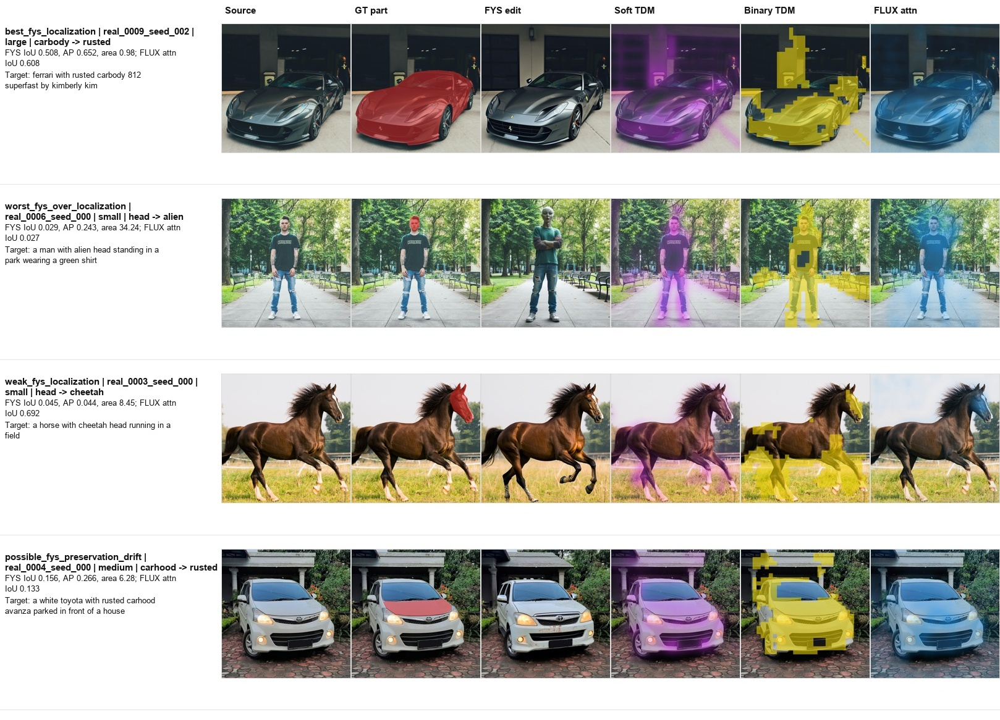

# Part-Level TDM Localization in Follow-Your-Shape

This repository is a small diagnostic study of part-level controllable image editing. The main question is:

> When an edit targets a local object part, does Follow-Your-Shape's trajectory divergence map (TDM) localize the intended part, or does it expand to a broader object/background region?

The experiment uses a fixed PartEdit-Bench subset with ground-truth part masks, runs Follow-Your-Shape (FYS), and compares FYS-TDM with a simple FLUX target-token attention localization baseline.

## Key Result

FYS-TDM is useful as an edit-localization signal, but it often over-localizes for part-level edits, especially small parts. A simple FLUX target-token attention signal is often more spatially concentrated.

| Method                      | Part size |      Binary IoU |         Soft AP | Predicted / GT area |
| --------------------------- | --------: | --------------: | --------------: | ------------------: |
| FYS TDM                     |     large | 0.308 +/- 0.138 | 0.371 +/- 0.186 |       3.19 +/- 1.63 |
| FYS TDM                     |    medium | 0.161 +/- 0.066 | 0.225 +/- 0.133 |       5.40 +/- 2.03 |
| FYS TDM                     |     small | 0.048 +/- 0.014 | 0.124 +/- 0.086 |     16.98 +/- 10.69 |
| FLUX target-token attention |     large | 0.425 +/- 0.174 | 0.609 +/- 0.196 |       2.38 +/- 1.26 |
| FLUX target-token attention |    medium | 0.267 +/- 0.108 | 0.338 +/- 0.146 |       3.43 +/- 1.14 |
| FLUX target-token attention |     small | 0.240 +/- 0.276 | 0.501 +/- 0.415 |     13.09 +/- 15.09 |

## Visual Examples

Each row shows one representative case: source image, ground-truth part mask, FYS edited image, soft TDM, binary TDM, and FLUX target-token attention.

<div align="center">
  <a href="core/results/controlled_revision/figures/final_note_mask_quality_comparison.jpg">
    
  </a>
  <br>
  <sub>Click to open full resolution.</sub>
</div>

Supporting diagnostic sheets for all 36 runs are in:

- `core/results/controlled_revision/figures/tdm_diagnostic_sheet_part1.jpg`
- `core/results/controlled_revision/figures/tdm_diagnostic_sheet_part2.jpg`
- `core/results/controlled_revision/figures/tdm_diagnostic_sheet_part3.jpg`

## What Is Included

- `core/data/partedit_subset/pilot_12_manifest.json`: fixed 12-case subset.
- `core/artifacts/partedit_pilot_12_cases_strict.tar.gz`: portable copy of selected images, masks, references, and metadata.
- `core/configs/fys_controlled_revision.json`: fixed experiment configuration and pinned FYS submodule revision.
- `core/scripts/run_fys_pilot.py`: FYS batch runner.
- `core/scripts/run_flux_attention_baseline.py`: FLUX attention baseline runner.
- `core/notebooks/03_evaluate_controlled_revision.ipynb`: final evaluation notebook.
- `core/results/follow_your_shape/`: FYS edited images, logs, configs, and TDM artifacts.
- `core/results/flux_attention_baseline/`: attention maps, logs, and configs.
- `core/results/controlled_revision/`: final metric tables and qualitative figures.
- `core/reports/final_note.md`: compact project note.

Main result tables:

- `core/results/controlled_revision/localization_comparison.csv`
- `core/results/controlled_revision/fys_run_metrics.csv`
- `core/results/controlled_revision/flux_attention_metrics.csv`
- `core/results/controlled_revision/compact_fys_summary.csv`

## Methods

### Follow-Your-Shape TDM

FYS is run with `flux-dev`, guidance `2.0`, `15` denoising steps, `front=2`, `inject=4`, no ControlNet, no oracle mask, and offload enabled. Each case is run with seeds `0, 1, 2`.

### FLUX Target-Token Attention

The baseline encodes the source image, performs source-prompt inversion, then runs plain target-prompt FLUX denoising without KV injection. It records softmax attention mass from image-token queries to selected target part/edit T5 tokens in late single-stream blocks. This is a localization-only diagnostic baseline, not an editing method.

## Reproduce

Recommended GPU: one A800/A100/H800 80GB GPU, Python 3.10, and 100GB+ available disk space for FLUX downloads.

Clone and unpack the selected cases:

```bash
export WORKDIR=/path/to/data-disk
mkdir -p "$WORKDIR"
cd "$WORKDIR"
git clone --recurse-submodules https://github.com/ptan853/part-level-tdm-localization.git part-level-overediting
cd part-level-overediting
tar -xzf core/artifacts/partedit_pilot_12_cases_strict.tar.gz
```

If `core/third_party/FollowYourShape/` is empty after cloning, initialize the submodule from the repository root:

```bash
git submodule update --init --recursive
```

Check that the submodule is present:

```bash
test -f core/third_party/FollowYourShape/src/edit.py && echo "FollowYourShape ready"
git submodule status --recursive
```

Do not use GitHub's "Download ZIP" for full reproduction, because ZIP downloads do not include submodule contents.

Set caches:

```bash
export HF_HOME="$WORKDIR/hf_cache"
export HUGGINGFACE_HUB_CACHE="$HF_HOME/hub"
export TRANSFORMERS_CACHE="$HF_HOME/transformers"
export TORCH_HOME="$WORKDIR/torch_cache"
export PIP_CACHE_DIR="$WORKDIR/pip_cache"
export OMP_NUM_THREADS=8
mkdir -p "$HF_HOME" "$HUGGINGFACE_HUB_CACHE" "$TRANSFORMERS_CACHE" "$TORCH_HOME" "$PIP_CACHE_DIR"
```

If HuggingFace or PyPI access is slow, optionally set mirrors:

```bash
export HF_ENDPOINT=https://hf-mirror.com
export PIP_INDEX_URL=https://mirrors.aliyun.com/pypi/simple/
```

Install dependencies. If your image already has a working CUDA PyTorch, avoid reinstalling Torch.

```bash
pip install -e .

cd core/third_party/FollowYourShape
pip install -e ".[all]"
cd ../../..

python -m pip install --force-reinstall \
  "numpy==1.26.4" \
  "opencv-python==4.10.0.84" \
  "transformers==4.44.2" \
  "tokenizers==0.19.1" \
  "diffusers==0.32.2" \
  "huggingface-hub==0.25.2" \
  "seaborn==0.13.2" \
  "scikit-image==0.24.0"
```

Accept the FLUX.1-dev license and log in:

```bash
hf auth login
```

Run the full experiment:

```bash
python core/scripts/run_fys_pilot.py \
  --manifest core/data/partedit_subset/pilot_12_manifest.json \
  --seeds 0,1,2 \
  --execute

python core/scripts/run_flux_attention_baseline.py \
  --manifest core/data/partedit_subset/pilot_12_manifest.json \
  --seeds 0,1,2 \
  --execute
```

Run evaluation:

```bash
python -m jupyter nbconvert --execute --to notebook --inplace core/notebooks/03_evaluate_controlled_revision.ipynb
```

## Metrics

- `binary_iou`: IoU between predicted binary localization mask and GT part mask.
- `soft_ap`: average precision using the soft localization map as a pixel-level score.
- `pred_to_gt_area_ratio`: predicted binary area divided by GT part area.
- `soft_inside_gt_mass`: fraction of soft localization mass inside the GT part.
- `outside_mask_psnr`, `outside_mask_global_ssim`, `outside_mask_lpips`: preservation outside the GT part mask for FYS edited images.

The FLUX attention baseline is localization-only, so image-preservation metrics are reported only for FYS edited images.
