# All 60 Cases

Red: evaluation GT. Blue: actual binary edit support. Masks are overlaid on the source, not on generated outputs.

Columns: source, GT, FYS TDM mask, shared gate mask, FYS output, Endpoint N=7 output, RK2 N=7 output.

synth_0014 retains its source and masks; final outputs were not saved by the safety filter.

## synth_0000: head -> robot

Target: A alien with robot head at a city

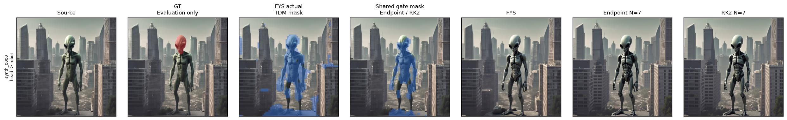

## synth_0001: head -> bear

Target: A robot with bear head at a school

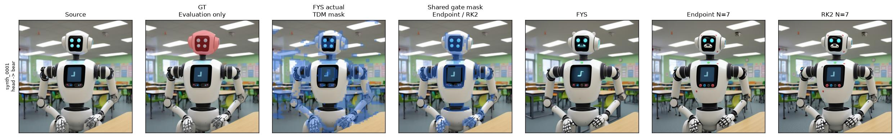

## synth_0002: head -> bear

Target: A robot with bear head at a park

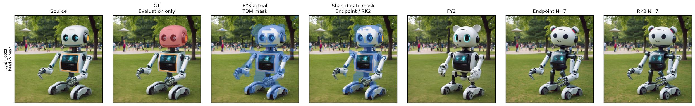

## synth_0003: head -> robot

Target: A alien with robot head at a museum

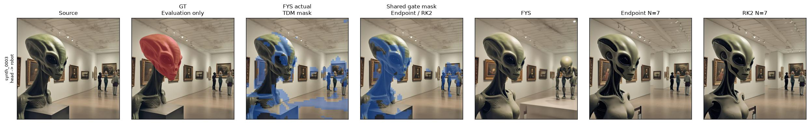

## synth_0004: head -> tattooed

Target: A robot with tattooed head at a office

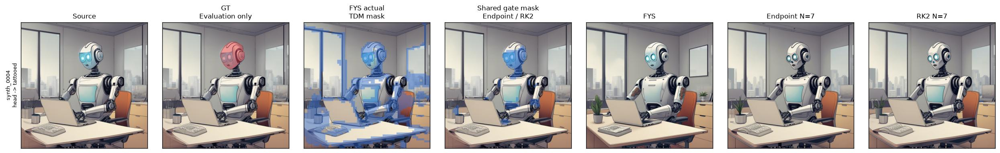

## synth_0005: head -> robot

Target: A man with robot head at a gym

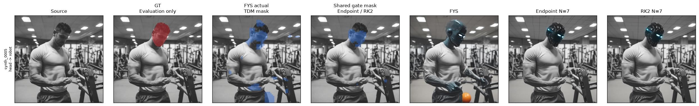

## synth_0006: head -> robot

Target: A girl with robot head at a beach

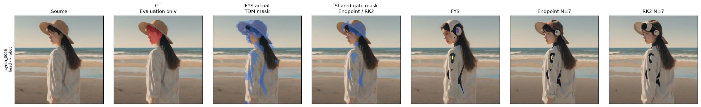

## synth_0007: head -> robot

Target: A alien with robot head at a school

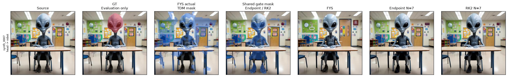

## synth_0008: head -> alien

Target: A robot with alien head at a park

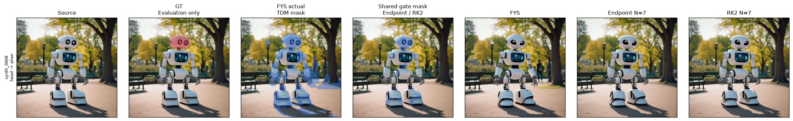

## synth_0009: head -> bear

Target: A alien with bear head at a museum

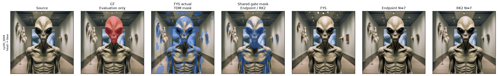

## synth_0010: torso -> batman

Target: A robot with batman torso at a school

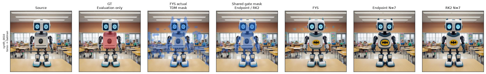

## synth_0011: torso -> spiderman

Target: A robot with spiderman torso at a museum

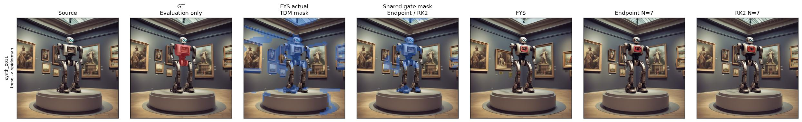

## synth_0012: torso -> spiderman

Target: A robot with spiderman torso at a museum

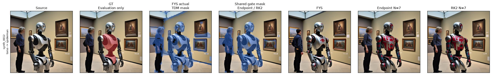

## synth_0013: torso -> uniform

Target: A alien with uniform torso at a school

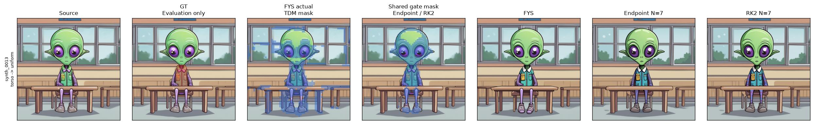

## synth_0014: torso -> robot

Target: A alien with robot torso at a gym

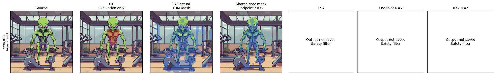

## synth_0015: torso -> formal-suit

Target: A robot with formal-suit torso at a restaurant

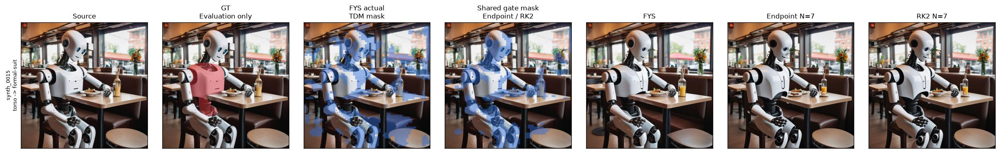

## synth_0016: torso -> armor

Target: A girl with armor torso at a stadium

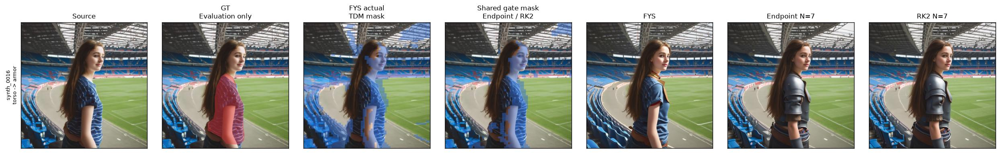

## synth_0017: torso -> robotic-parts

Target: A dinosaur with robotic-parts torso at a museum

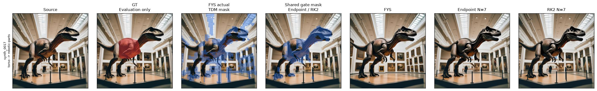

## synth_0018: torso -> armor

Target: A boy with armor torso at a restaurant

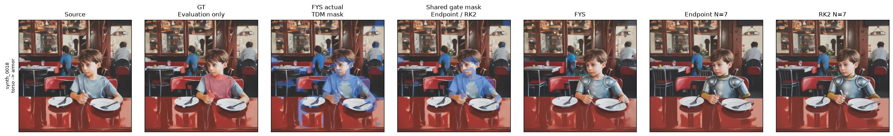

## synth_0019: hair -> Wavy

Target: A Portrait of girl with Wavy hair at a forest

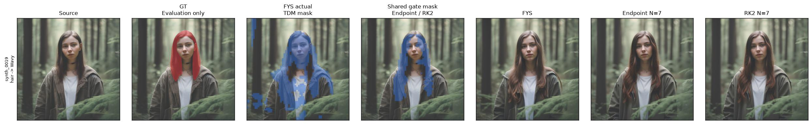

## synth_0020: hair -> Curls

Target: A Portrait of boy with Curls hair at a park

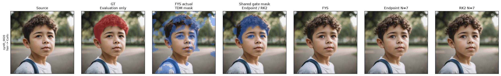

## synth_0021: hair -> Afro

Target: A Portrait of boy with Afro hair at a beach

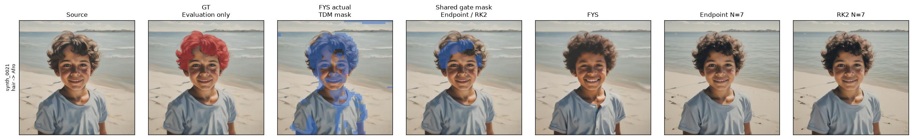

## synth_0022: hair -> Kinky

Target: A Portrait of boy with Kinky hair at a park

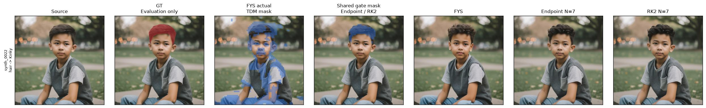

## synth_0023: hair -> blond

Target: A Portrait of man with blond hair at a beach

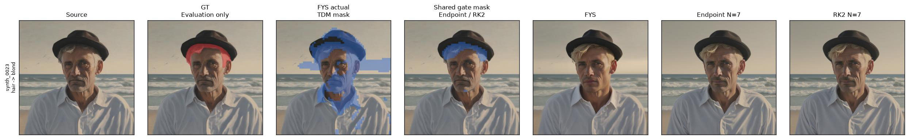

## synth_0024: hair -> Curley

Target: A Portrait of girl with Curley hair at a mountain

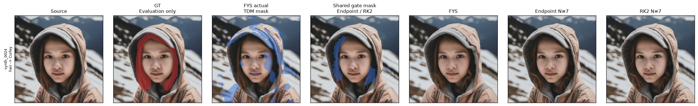

## synth_0025: hair -> Botticelli-Curls

Target: A Portrait of boy with Botticelli-Curls hair at a street

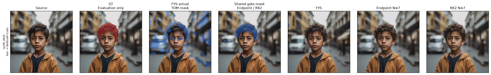

## synth_0026: hair -> Curls

Target: A Portrait of man with Curls hair at a house

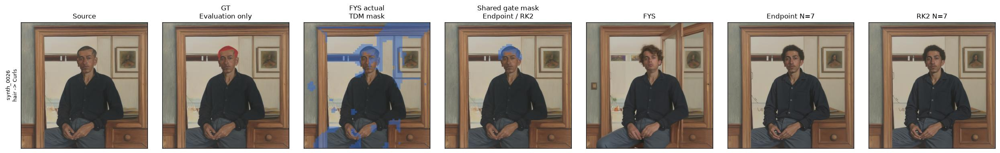

## synth_0027: hair -> Curls

Target: A Portrait of woman with Curls hair at a school

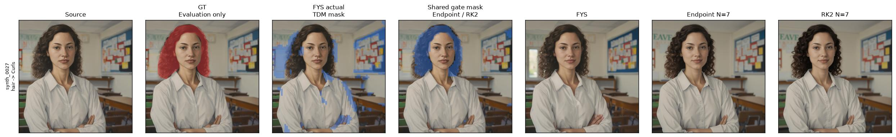

## synth_0028: head -> dragon

Target: A cow with dragon head at a restaurant

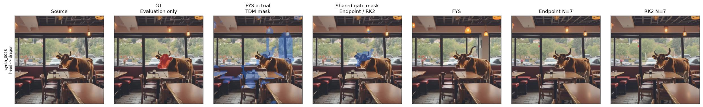

## synth_0029: head -> lion

Target: A dog with lion head at a pool

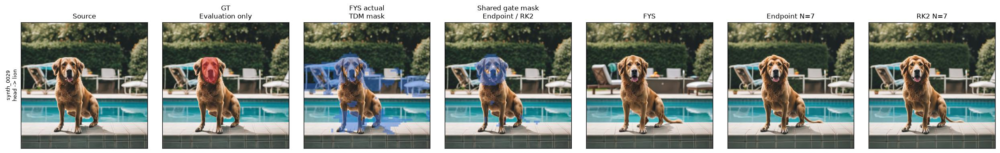

## synth_0030: head -> dog

Target: A bear with dog head at a jungle

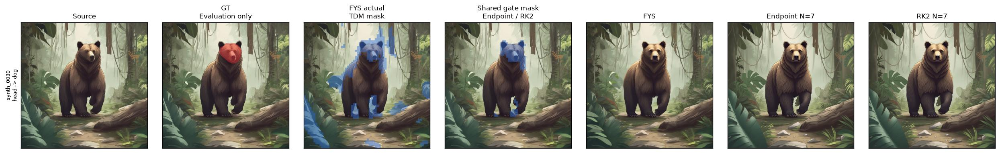

## synth_0031: head -> dragon

Target: A horse with dragon head at a jungle

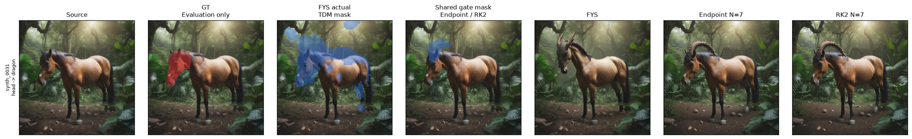

## synth_0032: head -> dragon

Target: A cat with dragon head at a desert

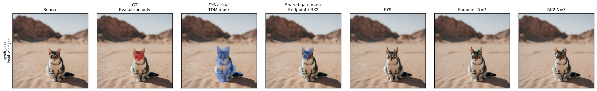

## synth_0033: head -> cat

Target: A dog with cat head at a restaurant

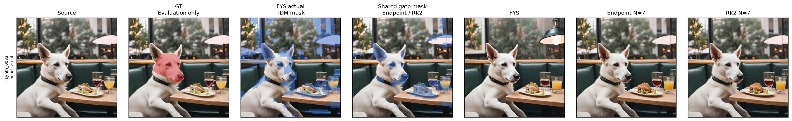

## synth_0034: head -> unicorn

Target: A dog with unicorn head at a mountain

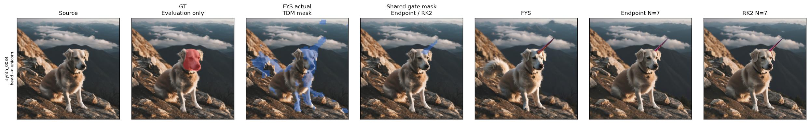

## synth_0035: head -> cheetah

Target: A cat with cheetah head at a museum

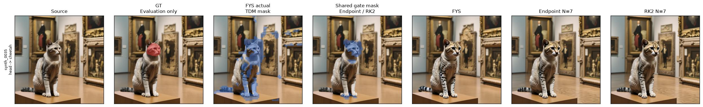

## synth_0036: head -> lion

Target: A bear with lion head at a zoo

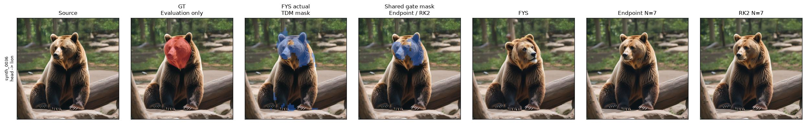

## synth_0037: head -> dragon

Target: A dog with dragon head at a farm

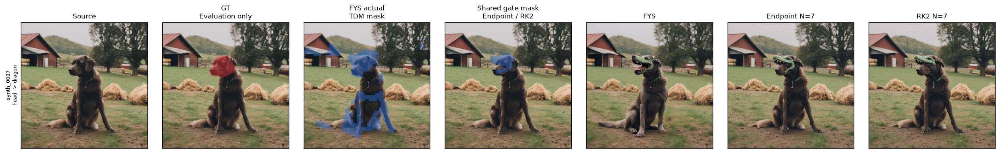

## synth_0038: head -> dragon

Target: A horse with dragon head at a zoo

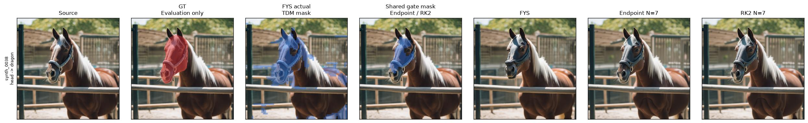

## synth_0039: head -> unicorn

Target: A cow with unicorn head at a house

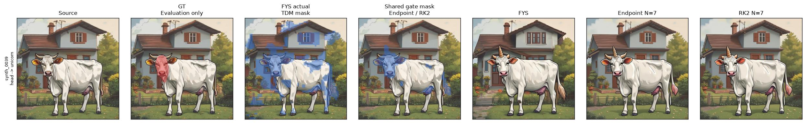

## synth_0040: head -> tiger

Target: A bear with tiger head at a pool

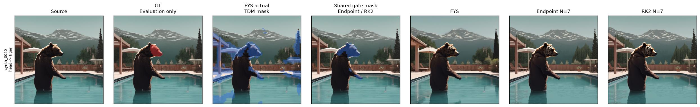

## synth_0041: head -> panda

Target: A cat with panda head at a mountain

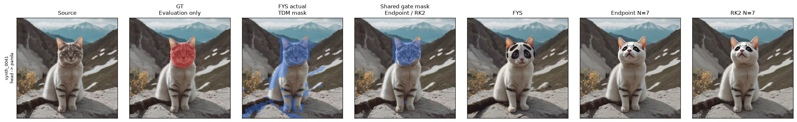

## synth_0042: head -> cheetah

Target: A panda with cheetah head at a school

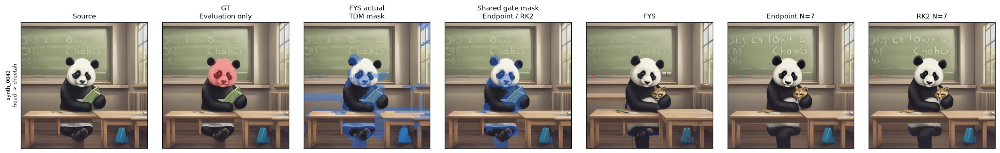

## synth_0043: head -> dragon

Target: A bear with dragon head at a jungle

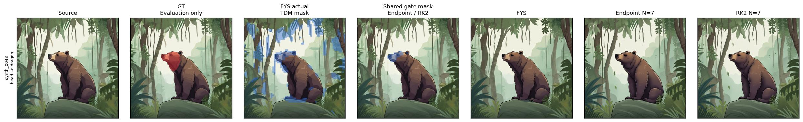

## synth_0044: head -> lion

Target: A bear with lion head at a zoo

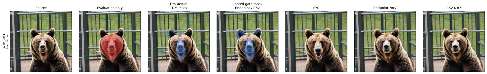

## synth_0045: head -> panda

Target: A dog with panda head at a store

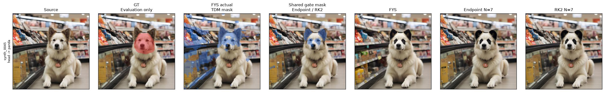

## synth_0046: car body -> armored

Target: A luxury-car with armored car body at a mountain road

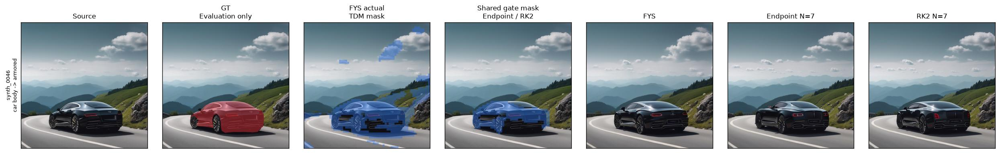

## synth_0047: car body -> futuristic

Target: A sedan with futuristic car body at a parking lot

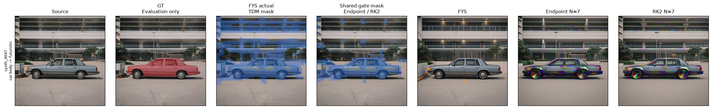

## synth_0048: car body -> rusted

Target: A classic-car with rusted car body at a suburban road

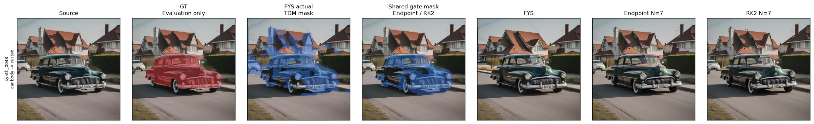

## synth_0049: car body -> neon-lit

Target: A classic-car with neon-lit car body at a suburban road

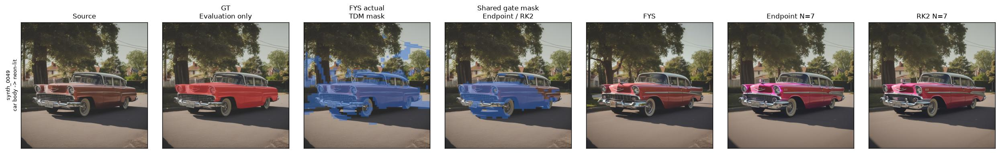

## synth_0050: car hood -> black

Target: A racing-car with black car hood at a highway

## synth_0051: car hood -> vinyl-art

Target: A classic-car with vinyl-art car hood at a garage

## synth_0052: car hood -> Digital-Camouflage

Target: A full front facing view of racing car with Digital-Camouflage car hood at a parking lot

## synth_0053: car hood -> Destroyed

Target: A full front facing view of BMW car with Destroyed car hood at a parking lot

## synth_0054: car hood -> Rusty

Target: A full front facing view of Porsche car with Rusty car hood at a road

## synth_0055: car hood -> Graffiti

Target: A full front facing view of Toyota car with Graffiti car hood at a parking lot

## synth_0056: seat -> fabric

Target: A closeup leather chair with fabric seat at a apartment

## synth_0057: seat -> plastic

Target: A closeup soft chair with plastic seat at a photo studio

## synth_0058: seat -> rusted

Target: A closeup folding chair with rusted seat at a classroom

## synth_0059: seat -> wooden

Target: A closeup leather chair with wooden seat at a classroom

