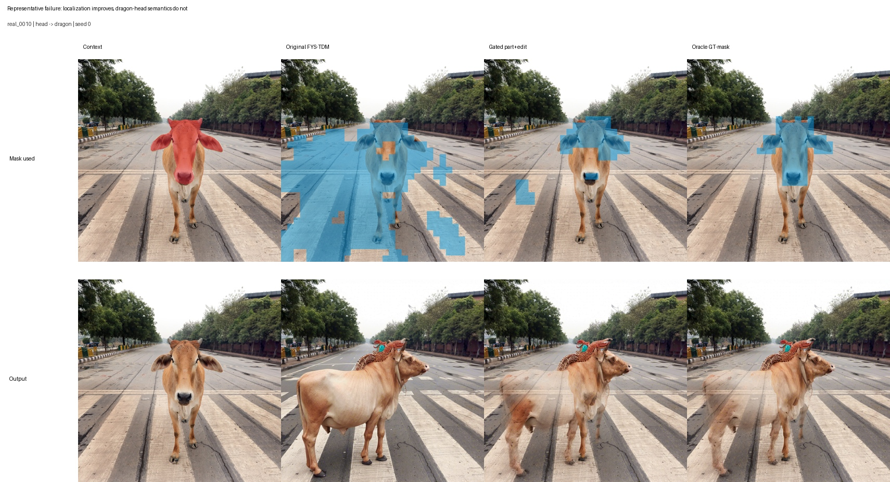
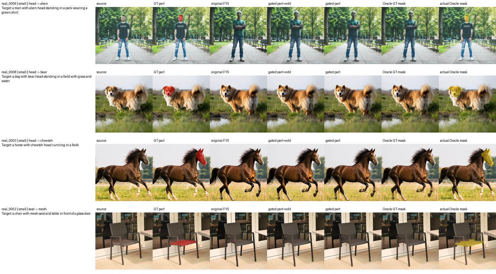
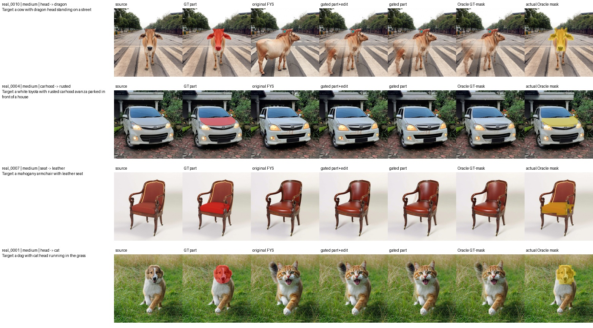
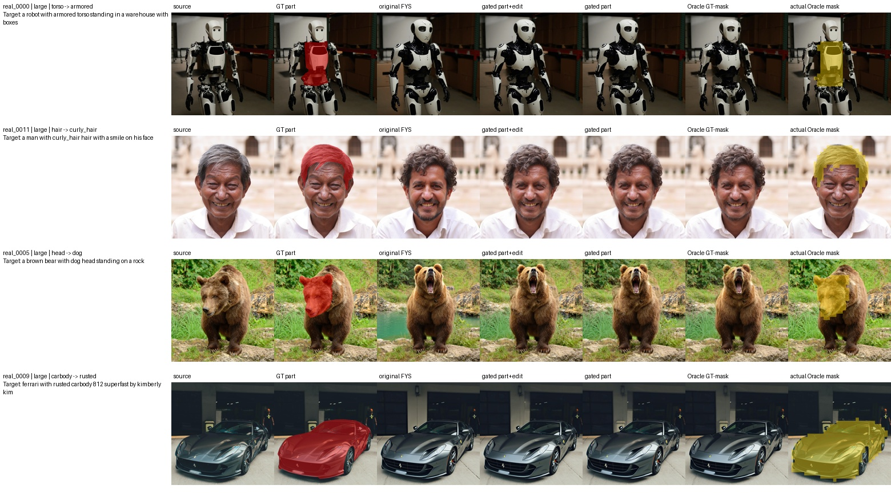

# Controlled Revision Note: Attention-Gated And Oracle Part Control In Follow-Your-Shape

Code and artifacts: `https://github.com/ptan853/part-level-tdm-localization`

## Problem

This mini-project tests a narrow controllable image-editing question: when the requested edit targets a local object part, does Follow-Your-Shape's trajectory divergence map (TDM) localize the intended part, or does it expand to a broader object/background region? I then test whether target-token attention can gate the TDM and improve part-level control.

The motivating gap is that Follow-Your-Shape is effective for shape-aware object editing, but its TDM is derived from denoising trajectory divergence rather than explicit part-token localization. For small local components such as a head, hair, seat, hood, torso, or car body, this signal may capture broader edit-induced change instead of the intended part boundary.

## Experimental Setup

I used a fixed PartEdit-Bench subset of 12 cases, balanced by target part size: 4 small, 4 medium, and 4 large cases. Each case was executed with three fixed seeds, `0, 1, 2`, giving 36 command runs per method. In this inversion-based FYS path, the outputs are deterministic, so I report the results as 12 unique case outputs per method rather than treating repeated seed rows as independent samples. The target prompt uses PartEdit's part-aware `p2p_prompt`, such as

```
"a dog with bear head standing in a field with grass and water"
```

because the original changed prompt can imply whole-object replacement.

The FYS configuration is fixed as `flux-dev`, guidance `2.0`, `15` denoising steps, `front=2`, `inject=4`, no ControlNet, and offload enabled. Original and attention-gated runs estimate the injection mask; the Oracle ablation substitutes the projected GT part mask at the same Stage-3 decision point. The pinned Follow-Your-Shape submodule revision is `1090ed42af153fd696aaaa659c509a97bdd249d1`.

The exact commands for reproducing the five main experiment runs are listed below. The repository README provides the full environment setup, dataset extraction, dependency installation, and notebook evaluation commands.

Original FYS-TDM:

```bash
python core/scripts/run_fys_pilot.py \
  --manifest core/data/partedit_subset/pilot_12_manifest.json \
  --seeds 0,1,2 \
  --execute
```

FLUX target-token attention localization baseline:

```bash
python core/scripts/run_flux_attention_baseline.py \
  --manifest core/data/partedit_subset/pilot_12_manifest.json \
  --seeds 0,1,2 \
  --execute
```

Attention-gated FYS with part+edit tokens:

```bash
python core/scripts/run_fys_pilot.py \
  --manifest core/data/partedit_subset/pilot_12_manifest.json \
  --seeds 0,1,2 \
  --tdm-mask-mode attention_gated \
  --attention-token-mode part_edit \
  --execute
```

Attention-gated FYS with part-only tokens:

```bash
python core/scripts/run_fys_pilot.py \
  --manifest core/data/partedit_subset/pilot_12_manifest.json \
  --seeds 0,1,2 \
  --tdm-mask-mode attention_gated \
  --attention-token-mode part \
  --output-root core/results/fys_mask_ablation/attention_gated_tdm_part \
  --run-matrix core/results/run_matrices/attention_gated_part_pilot_12_manifest_multi_seed.csv \
  --execute
```

Oracle GT-mask FYS:

```bash
python core/scripts/run_fys_pilot.py \
  --manifest core/data/partedit_subset/pilot_12_manifest.json \
  --seeds 0 \
  --oracle-mask \
  --execute
```

## Baseline And Variant

I added a simple FLUX target-token attention localization baseline. For each case and seed, the baseline encodes the source image, performs source-prompt inversion, and then runs plain target-prompt FLUX denoising from the same inverted latent, without FYS KV injection or oracle masks. For localization, it records the softmax attention mass from image-token queries to the selected target part/edit T5 tokens. I use late FLUX single-stream blocks `28-37` and the same middle denoising window as FYS-TDM, i.e. step indices `2-8` under the 15-step schedule. The maps are averaged over selected tokens, heads, layers, and recorded steps, reshaped to the `32 x 32` image-token grid, smoothed, and binarized with Otsu thresholding. This baseline is localization-only; it does not edit the image.

The main tested variant is attention-gated FYS. It keeps the original FYS inversion, target denoising, and late KV-injection schedule, but replaces the final binary TDM mask with a TDM-attention hybrid mask. The hybrid mask is computed by normalizing the smoothed TDM and target-token attention map, multiplying them as a soft gate, smoothing the product, and binarizing with Otsu thresholding. I compare `part+edit` token attention with `part`-only token attention.

The Oracle ablation keeps the same source inversion, target-prompt trajectory, and late KV-injection schedule. It projects the PartEdit GT mask to the FLUX image-token grid using nearest-neighbor latent-grid resizing followed by `2 x 2` max pooling, then uses that binary grid directly as the Stage-3 injection mask. The saved injection masks match the projected GT masks for all `12/12` cases. This isolates whether localization quality alone is the limiting factor without presenting GT localization as an estimated-mask result.

## Metrics

Localization is evaluated against the PartEdit ground-truth part mask using *binary IoU, soft AP, predicted/GT area ratio*, and *soft inside-GT mass.* Editing and preservation are evaluated for generated images using *outside-mask L1, PSNR, SSIM,* and *LPIPS*. The FLUX attention baseline is localization-only, so image-preservation metrics are not applicable to that baseline.

Oracle localization scores are fixed by construction (`IoU=1`, `AP=1`, area ratio `=1`) and are not included as evidence that one localization estimator outperforms another. The meaningful Oracle comparison is the final image under an exact mask.

I also add a compact qualitative local-edit assessment on the 12 unique seed-0 outputs. This is intentionally separated from mask localization:

- **Local edit success:** `0` = requested part edit absent; `1` = partial, weak, or wrong extent; `2` = requested part edit clearly present.
- **Non-target preservation:** `0` = major object/background drift; `1` = moderate drift; `2` = mostly preserved outside the target part.

## Results

Main quantitative comparison for the editing methods.

Mask localization against GT part masks:

| Method                                | Command runs | Unique outputs | Binary IoU ↑ | Soft AP ↑ | Predicted / GT area ↓ |
| ------------------------------------- | -----------: | -------------: | ------------: | ---------: | ---------------------: |
| Original FYS-TDM                      |           36 |             12 |         0.174 |      0.247 |                   8.04 |
| Attention-gated FYS, part+edit tokens |           36 |             12 |         0.327 |      0.591 |                   2.81 |
| Attention-gated FYS, part-only tokens |           36 |             12 |         0.323 |      0.619 |                   2.51 |

Edited-image preservation outside the GT part mask:

| Method                                | Outside L1 ↓ | Outside PSNR ↑ | Outside SSIM ↑ | Outside LPIPS ↓ |
| ------------------------------------- | ------------: | --------------: | --------------: | ---------------: |
| Original FYS-TDM                      |         0.056 |           20.36 |           0.919 |            0.191 |
| Attention-gated FYS, part+edit tokens |         0.047 |           21.79 |           0.938 |            0.146 |
| Attention-gated FYS, part-only tokens |         0.046 |           22.10 |           0.941 |            0.142 |
| Oracle GT-mask FYS                    |         0.043 |           22.95 |           0.953 |            0.126 |

Full tables:

- `core/results/controlled_revision/localization_comparison.csv`
- `core/results/controlled_revision/fys_run_metrics.csv`
- `core/results/controlled_revision/flux_attention_metrics.csv`
- `core/results/controlled_revision/compact_fys_summary.csv`
- `core/results/attention_gated_fys_eval/attention_gated_fys_summary.csv`
- `core/results/attention_gated_fys_eval/mask_localization_metrics.csv`
- `core/results/attention_gated_fys_eval/image_preservation_metrics.csv`
- `core/results/oracle_mask_eval/oracle_mask_validation.csv`
- `core/results/oracle_mask_eval/oracle_image_preservation_metrics.csv`
- `core/results/oracle_mask_eval/oracle_comparison_summary.csv`
- `core/results/oracle_mask_eval/oracle_per_case_deltas.csv`

The main trend is consistent with the initial diagnosis: original FYS-TDM over-localizes for part-level edits. Attention-gated TDM improves localization substantially, reducing the mean predicted/GT area ratio from `8.04` to `2.51-2.81` and improving mean binary IoU from `0.174` to about `0.32`. Part-only attention gives the sharpest area ratio and highest soft AP, while part+edit attention gives a similar IoU.

However, better masks do not fully solve the editing problem. In difficult cases such as `hair -> curly_hair`, the mask becomes much closer to the hair region, but the face can still change. This suggests that FYS's mask is a late, soft KV-routing constraint rather than a hard spatial edit constraint. Target-prompt trajectory changes can accumulate during unconstrained middle steps and through non-attention pathways, so the bottleneck shifts from mask quality to when and how strongly the trajectory is controlled.

The Oracle result strengthens this interpretation. Projected GT masks produce the best automatic non-target preservation (`L1=0.043`, `PSNR=22.95`, `SSIM=0.953`, `LPIPS=0.126`). Manual review nevertheless gives Oracle a mean local-edit score of only `0.92`, below part+edit gating (`1.08`) and close to original FYS (`1.00`). Oracle therefore confirms that improved localization and pixel-level preservation are not sufficient for successful semantic part editing under the current injection schedule.

Compact per-case local-edit assessment:

| Method                                | Unique outputs | Mean local edit success ↑ | Mean non-target preservation ↑ | Full local-edit cases | Full preservation cases |
| ------------------------------------- | -------------: | -------------------------: | ------------------------------: | --------------------: | ----------------------: |
| Original FYS-TDM                      |             12 |                       1.00 |                            0.92 |                5 / 12 |                  2 / 12 |
| Attention-gated FYS, part+edit tokens |             12 |                       1.08 |                            1.50 |                5 / 12 |                  6 / 12 |
| Attention-gated FYS, part-only tokens |             12 |                       1.00 |                            1.50 |                5 / 12 |                  6 / 12 |
| Oracle GT-mask FYS                    |             12 |                       0.92 |                            1.42 |                4 / 12 |                  5 / 12 |

This human assessment separates two effects that are partially conflated in automatic image metrics. Attention-gated masks improve non-target preservation substantially, but they do not reliably improve the semantic success of the requested part edit. The part+edit variant gives only a small average gain in local edit success (`1.08` vs. `1.00`), while part-only matches the original FYS local-edit score. This suggests that the main benefit of attention gating is spatial preservation, not stronger semantic editing.

By target part size:

| Part size | Method                                | Mean local edit success ↑ | Mean non-target preservation ↑ |
| --------- | ------------------------------------- | -------------------------: | ------------------------------: |
| Small     | Original FYS-TDM                      |                       0.75 |                            1.25 |
| Small     | Attention-gated FYS, part+edit tokens |                       0.75 |                            1.50 |
| Small     | Attention-gated FYS, part-only tokens |                       0.75 |                            1.50 |
| Small     | Oracle GT-mask FYS                    |                       1.00 |                            1.75 |
| Medium    | Original FYS-TDM                      |                       1.00 |                            1.00 |
| Medium    | Attention-gated FYS, part+edit tokens |                       1.00 |                            1.50 |
| Medium    | Attention-gated FYS, part-only tokens |                       1.00 |                            1.50 |
| Medium    | Oracle GT-mask FYS                    |                       0.75 |                            1.00 |
| Large     | Original FYS-TDM                      |                       1.25 |                            0.50 |
| Large     | Attention-gated FYS, part+edit tokens |                       1.50 |                            1.50 |
| Large     | Attention-gated FYS, part-only tokens |                       1.25 |                            1.50 |
| Large     | Oracle GT-mask FYS                    |                       1.00 |                            1.50 |

| Case        | Part edit              | Original FYS local / preserve | Gated part+edit local / preserve | Gated part-only local / preserve | Oracle local / preserve | Note                                                                                                                          |
| ----------- | ---------------------- | ----------------------------: | -------------------------------: | -------------------------------: | ----------------------: | ----------------------------------------------------------------------------------------------------------------------------- |
| `real_0006` | `head -> alien`        |                       `1 / 1` |                          `1 / 1` |                          `1 / 1` |                 `2 / 1` | Gating preserves the person and background better, but the alien-head edit is mostly suppressed.                              |
| `real_0008` | `head -> bear`         |                       `0 / 2` |                          `0 / 2` |                          `0 / 2` |                 `0 / 2` | Head localization improves, but the head does not clearly become bear-like.                                                   |
| `real_0003` | `head -> cheetah`      |                       `0 / 1` |                          `0 / 1` |                          `0 / 1` |                 `0 / 2` | Original FYS changes the animal more visibly; gated versions keep the horse but weaken the cheetah-head edit.                 |
| `real_0002` | `seat -> mesh`         |                       `2 / 1` |                          `2 / 2` |                          `2 / 2` |                 `2 / 2` | Gating localizes and preserves the chair/background, but the mesh-seat semantic change is weak.                               |
| `real_0010` | `head -> dragon`       |                       `0 / 0` |                          `0 / 1` |                          `0 / 1` |                 `0 / 1` | Attention-gated masks focus near the head and restore some body/road content, but the global cow trajectory remains affected. |
| `real_0004` | `carhood -> rusted`    |                       `0 / 1` |                          `0 / 2` |                          `0 / 2` |                 `0 / 1` | The car is preserved better, but rust on the hood is not clear.                                                               |
| `real_0007` | `seat -> leather`      |                       `2 / 2` |                          `2 / 2` |                          `2 / 2` |                 `1 / 1` | All methods show the seat-material edit; gated versions better preserve the chair frame/background.                           |
| `real_0001` | `head -> cat`          |                       `2 / 1` |                          `2 / 1` |                          `2 / 1` |                 `2 / 1` | The cat-head edit is visible, and attention gating improves non-target preservation.                                          |
| `real_0000` | `torso -> armored`     |                       `2 / 1` |                          `2 / 1` |                          `2 / 1` |                 `1 / 2` | The torso is affected, but armor semantics remain partial.                                                                    |
| `real_0011` | `hair -> curly_hair`   |                       `2 / 0` |                          `2 / 1` |                          `2 / 1` |                 `2 / 1` | Hair localization improves, but face identity still changes.                                                                  |
| `real_0005` | `head -> dog`          |                       `1 / 0` |                          `1 / 2` |                          `1 / 2` |                 `0 / 2` | Bear body/background are preserved, but dog-head semantics remain partial.                                                    |
| `real_0009` | `carbody -> rusted`    |                       `0 / 1` |                          `1 / 2` |                          `0 / 2` |                 `1 / 1` | The car body is preserved better under gating, but the rusted-body edit is weak.                                              |

The original and gated ratings are saved at `core/results/attention_gated_fys_eval/local_edit_success_per_case.csv`; Oracle ratings are saved at `core/results/oracle_mask_eval/oracle_local_edit_review.csv`.

## Representative Cases

### Mask and Output Comparison

The two aligned rows below compare the **actual mask used for injection** with the corresponding generated output for `real_0007` (`seat -> leather`). The original FYS-TDM covers much of the chair (`3.55x` the GT area, IoU `0.128`). Part+edit gating reduces the support to `2.68x` (IoU `0.321`), part-only gating reduces it to `2.30x` (IoU `0.350`), and the Oracle column uses the projected GT support by construction.

The generated outputs become more source-like as the masks contract, but the relationship is not monotonic: original FYS and both gated variants received `2/2` for local-edit success and preservation, whereas the Oracle result received `1/2` and `1/2`. A sharper mask therefore changes the edit/preservation trade-off, but does not by itself guarantee a stronger semantic edit.

<p align="center">
  <a href="../results/oracle_mask_eval/figures/mask_output_method_comparison.jpg">
    
  </a>
</p>

### Representative Failure Case

`real_0010` (`head -> dragon`) is the clearest failure case. The original TDM spreads across the cow and road (`8.51x` the GT area, IoU `0.098`), while part+edit gating contracts the mask to `1.30x` (IoU `0.403`) and the Oracle uses the projected GT head region. The constrained outputs retain more of the source foreground and road than original FYS, confirming that the mask affects preservation. However, neither constrained result produces a convincing dragon head; the Oracle result receives `0/2` for local-edit success and `1/2` for preservation.

<p align="center">
  <a href="../results/oracle_mask_eval/figures/cow_road_failure_analysis.jpg">
    
  </a>
</p>

This failure separates localization from control. The more accurate masks suppress part of the non-target drift, but they cannot undo the global structure established during the earlier unconstrained target trajectory. Because FYS applies the mask only through late-stage KV injection, it behaves as a soft preservation mechanism rather than a hard spatial editing constraint.

The full qualitative overview is split into three panels below so that the generated images and masks remain readable. Together they show all 12 cases at seed 0, including the source, GT part mask, original FYS result, attention-gated outputs, and mask visualizations.

<p align="center">
  <a href="../results/attention_gated_fys_eval/figures/attention_gated_fys_overview_part1.jpg">
    
  </a>
</p>

<p align="center">
  <a href="../results/attention_gated_fys_eval/figures/attention_gated_fys_overview_part2.jpg">
    
  </a>
</p>

<p align="center">
  <a href="../results/attention_gated_fys_eval/figures/attention_gated_fys_overview_part3.jpg">
    
  </a>
</p>

For additional mask diagnostics, the repository also includes `core/results/attention_gated_fys_eval/figures/mask_metric_boxplots.png` and `core/results/controlled_revision/figures/tdm_diagnostic_sheet_part*.jpg`.

The Oracle comparison below shows all 12 seed-0 cases in three readable panels. Each row contains the source, GT part, original FYS result, both attention-gated outputs, Oracle output, and the actual Oracle mask used for injection.

<p align="center">
  <a href="../results/oracle_mask_eval/figures/oracle_comparison_part1.jpg">
    
  </a>
</p>

<p align="center">
  <a href="../results/oracle_mask_eval/figures/oracle_comparison_part2.jpg">
    
  </a>
</p>

<p align="center">
  <a href="../results/oracle_mask_eval/figures/oracle_comparison_part3.jpg">
    
  </a>
</p>

## Conclusion

The controlled revision supports a concrete technical gap: trajectory-guided mask-free editing remains useful for object-level control, but its TDM can be too coarse for part-level edits. Token-aware attention and even GT masks projected to the FLUX token grid improve non-target preservation, but better masks alone do not guarantee stronger semantic part editing under the current FYS injection schedule. The remaining limitation is therefore not only mask estimation; it also concerns when and how the source and target trajectories are constrained.
