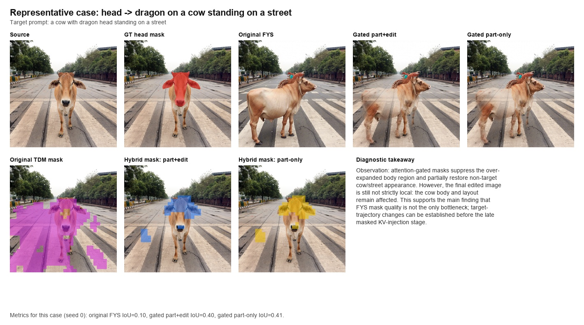
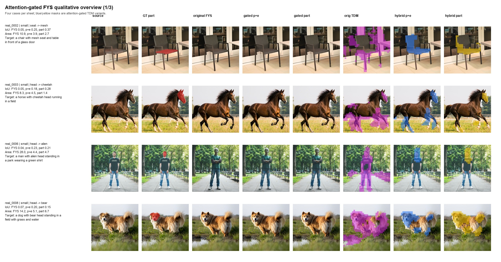
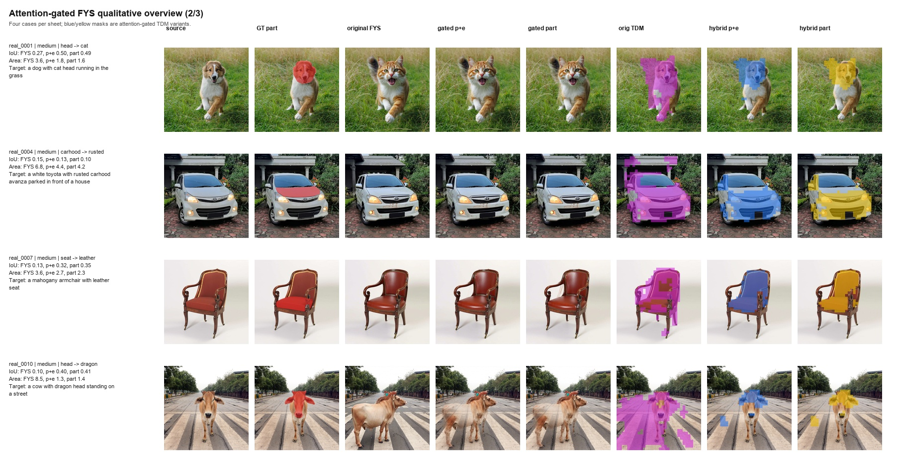
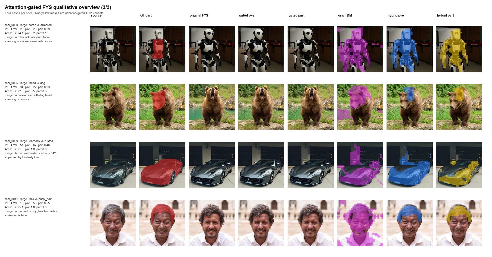

# Controlled Revision Note: Attention-Gated Part Localization in Follow-Your-Shape

Code and artifacts: `https://github.com/ptan853/part-level-tdm-localization`

## Problem

This mini-project tests a narrow controllable image-editing question: when the requested edit targets a local object part, does Follow-Your-Shape's trajectory divergence map (TDM) localize the intended part, or does it expand to a broader object/background region? I then test whether target-token attention can gate the TDM and improve part-level control.

The motivating gap is that Follow-Your-Shape is effective for shape-aware object editing, but its TDM is derived from denoising trajectory divergence rather than explicit part-token localization. For small local components such as a head, hair, seat, hood, torso, or car body, this signal may capture broader edit-induced change instead of the intended part boundary.

## Experimental Setup

I used a fixed PartEdit-Bench subset of 12 cases, balanced by target part size: 4 small, 4 medium, and 4 large cases. Each case was run with three fixed seeds, `0, 1, 2`, for 36 Follow-Your-Shape runs. The target prompt uses PartEdit's part-aware `p2p_prompt`, such as

```
"a dog with bear head standing in a field with grass and water"
```

because the original changed prompt can imply whole-object replacement.

The FYS configuration is fixed as `flux-dev`, guidance `2.0`, `15` denoising steps, `front=2`, `inject=4`, no ControlNet, no oracle mask, and offload enabled. The pinned Follow-Your-Shape submodule revision is `1d01f0d3a5fde5c11e8630808d1d59243894625d`. The three seed commands are retained for reproducibility, but the inversion-based FYS path is deterministic in this setup: each method gives 12 unique case outputs from 36 command runs.

## Baseline And Variant

I added a simple FLUX target-token attention localization baseline. For each case and seed, the baseline encodes the source image, performs source-prompt inversion, and then runs plain target-prompt FLUX denoising from the same inverted latent, without FYS KV injection or oracle masks. For localization, it records the softmax attention mass from image-token queries to the selected target part/edit T5 tokens. I use late FLUX single-stream blocks `28-37` and the same middle denoising window as FYS-TDM, i.e. step indices `2-8` under the 15-step schedule. The maps are averaged over selected tokens, heads, layers, and recorded steps, reshaped to the `32 x 32` image-token grid, smoothed, and binarized with Otsu thresholding. This baseline is localization-only; it does not edit the image.

The main tested variant is attention-gated FYS. It keeps the original FYS inversion, target denoising, and late KV-injection schedule, but replaces the final binary TDM mask with a TDM-attention hybrid mask. The hybrid mask is computed by normalizing the smoothed TDM and target-token attention map, multiplying them as a soft gate, smoothing the product, and binarizing with Otsu thresholding. I compare `part+edit` token attention with `part`-only token attention.

## Metrics

Localization is evaluated against the PartEdit ground-truth part mask using *binary IoU, soft AP, predicted/GT area ratio*, and *soft inside-GT mass.* Editing and preservation are evaluated for generated images using *outside-mask L1, PSNR, SSIM,* and *LPIPS*. The FLUX attention baseline is localization-only, so image-preservation metrics are not applicable to that baseline.

## Results

Main quantitative comparison for the editing methods.

Mask localization against GT part masks:

| Method                                | Runs | Binary IoU ↑ | Soft AP ↑ | Predicted / GT area ↓ |
| ------------------------------------- | ---: | ------------: | ---------: | ---------------------: |
| Original FYS-TDM                      |   36 |         0.174 |      0.247 |                   8.04 |
| Attention-gated FYS, part+edit tokens |   36 |         0.327 |      0.591 |                   2.81 |
| Attention-gated FYS, part-only tokens |   36 |         0.323 |      0.619 |                   2.51 |

Edited-image preservation outside the GT part mask:

| Method                                | Outside L1 ↓ | Outside PSNR ↑ | Outside SSIM ↑ | Outside LPIPS ↓ |
| ------------------------------------- | ------------: | --------------: | --------------: | ---------------: |
| Original FYS-TDM                      |         0.056 |           20.36 |           0.919 |            0.191 |
| Attention-gated FYS, part+edit tokens |         0.047 |           21.79 |           0.938 |            0.146 |
| Attention-gated FYS, part-only tokens |         0.046 |           22.10 |           0.941 |            0.142 |

Full tables:

- `core/results/controlled_revision/localization_comparison.csv`
- `core/results/controlled_revision/fys_run_metrics.csv`
- `core/results/controlled_revision/flux_attention_metrics.csv`
- `core/results/controlled_revision/compact_fys_summary.csv`
- `core/results/attention_gated_fys_eval/attention_gated_fys_summary.csv`
- `core/results/attention_gated_fys_eval/mask_localization_metrics.csv`
- `core/results/attention_gated_fys_eval/image_preservation_metrics.csv`

The main trend is consistent with the initial diagnosis: original FYS-TDM over-localizes for part-level edits. Attention-gated TDM improves localization substantially, reducing the mean predicted/GT area ratio from `8.04` to `2.51-2.81` and improving mean binary IoU from `0.174` to about `0.32`. Part-only attention gives the sharpest area ratio and highest soft AP, while part+edit attention gives a similar IoU.

However, better masks do not fully solve the editing problem. In difficult cases such as `hair -> curly_hair`, the mask becomes much closer to the hair region, but the face can still change. This suggests that FYS's mask is a late, soft KV-routing constraint rather than a hard spatial edit constraint. Target-prompt trajectory changes can accumulate during unconstrained middle steps and through non-attention pathways, so the bottleneck shifts from mask quality to when and how strongly the trajectory is controlled.

## Representative Cases

The focused qualitative comparison below shows `real_0010` (`head -> dragon`). The original TDM expands over the cow body and road, while attention-gated masks focus closer to the head. The gated output partially restores non-target cow/street appearance, but the final edit remains globally affected. This supports the main interpretation: better masks help localization, but FYS's late masked KV injection is not a hard local-edit constraint.

<p align="center">
  <a href="../results/attention_gated_fys_eval/figures/cow_road_case_analysis.jpg">
    
  </a>
</p>

- `real_0010_seed_000`: original FYS IoU `0.10`; gated part+edit IoU `0.40`; gated part-only IoU `0.41`.
- The body becoming partially transparent/restored under gated masks is evidence that the mask has real effect.
- The remaining global drift is evidence that the target trajectory has already shaped the latent before late-stage masking.

The full qualitative overview is split into three panels below so that the generated images and masks remain readable. Together they show all 12 cases at seed 0, including the source, GT part mask, original FYS result, attention-gated outputs, and mask visualizations.

<p align="center">
  <a href="../results/attention_gated_fys_eval/figures/attention_gated_fys_overview_part1.jpg">
    
  </a>
</p>

<p align="center">
  <a href="../results/attention_gated_fys_eval/figures/attention_gated_fys_overview_part2.jpg">
    
  </a>
</p>

<p align="center">
  <a href="../results/attention_gated_fys_eval/figures/attention_gated_fys_overview_part3.jpg">
    
  </a>
</p>

For additional mask diagnostics, the repository also includes `core/results/attention_gated_fys_eval/figures/mask_metric_boxplots.png` and `core/results/controlled_revision/figures/tdm_diagnostic_sheet_part*.jpg`.

## Conclusion

The controlled revision supports a concrete technical gap: trajectory-guided mask-free editing remains useful for object-level control, but its TDM can be too coarse for part-level edits. Token-aware attention can sharpen the mask, but sharper masks alone do not guarantee local preservation under the current FYS injection schedule.
