# GT-mask diagnostic: controller and duration comparison

> Two-reviewer follow-up: [updated results, agreement and paired intervals](two_reviewer_update/README.md). The single-reviewer analysis below is retained as the historical record, not the latest combined analysis.

## Scope and deviation

This is an exploratory analysis of 59 paired cases, six conditions and one reviewer (354 ratings). The original protocol, old ratings and generation outputs are unchanged.

The primary analysis remains the four N=7 controller-by-mask conditions; N=15 is supplementary. synth_0014 remains outside the paired set due to unavailable conditions. No score is imputed. One initially missing score was explicitly supplied by the user; the correction and raw export are retained.

## Human results

| Method | Local edit | Preservation | Prompt | Quality | Joint (%) | Strict joint (%) |
| --- | ---: | ---: | ---: | ---: | ---: | ---: |
| endpoint_auto | 1.254 | 1.085 | 1.492 | 2.000 | 55.932 | 15.254 |
| rk2_auto | 1.254 | 1.119 | 1.559 | 1.983 | 59.322 | 13.559 |
| endpoint_gt | 1.271 | 1.525 | 1.525 | 2.000 | 69.492 | 23.729 |
| rk2_gt | 1.203 | 1.475 | 1.610 | 2.000 | 66.102 | 27.119 |
| rk2_n15_auto | 1.136 | 1.508 | 1.559 | 1.983 | 55.932 | 28.814 |
| rk2_n15_gt | 1.203 | 1.966 | 1.593 | 2.000 | 64.407 | 52.542 |

## Paired differences

10,000 paired case bootstrap draws, seed 20260908, stratified by part size (20/19/20). All six conditions remain paired. Intervals are conditional on this reviewer, percentile 95%, and not multiplicity-adjusted. Joint differences are proportions, not points on the 0-2 rubric.

| Contrast | Local edit [95% CI] | Preservation [95% CI] | Joint [95% CI] |
| --- | --- | --- | --- |
| Endpoint GT - auto | 0.017 [-0.102, 0.136] | 0.441 [0.254, 0.644] | 0.136 [0.017, 0.254] |
| RK2 GT - auto | -0.051 [-0.220, 0.119] | 0.356 [0.186, 0.542] | 0.068 [-0.051, 0.186] |
| RK2 - Endpoint (auto) | 0.000 [-0.119, 0.119] | 0.034 [-0.085, 0.153] | 0.034 [-0.034, 0.119] |
| RK2 - Endpoint (GT) | -0.068 [-0.186, 0.034] | -0.051 [-0.186, 0.085] | -0.034 [-0.102, 0.034] |
| Mask-by-controller interaction | -0.068 [-0.220, 0.068] | -0.085 [-0.254, 0.085] | -0.068 [-0.186, 0.051] |
| RK2 N15 - N7 (auto) | -0.119 [-0.254, 0.000] | 0.390 [0.237, 0.542] | -0.034 [-0.136, 0.068] |
| RK2 N15 - N7 (GT) | 0.000 [-0.119, 0.136] | 0.492 [0.356, 0.627] | -0.017 [-0.085, 0.051] |

## Interpretation limits

Source-part GT is not necessarily the target edit footprint. Improved preservation alone does not establish semantic success. These results do not establish general model incapability, an optimal duration, controller equivalence, or superiority across reviewers. Footprint-specific results (including expansion) and all four human criteria are retained in the accompanying CSVs.

Automatic metrics reuse the completed evaluation without GPU recomputation. Strict and buffered regions remain fixed across methods; inside-region similarity is descriptive, not semantic success. See automatic_summary.csv and automatic_paired_bootstrap.csv.

## Reproduce

From the repository root:

```bash
.venv/bin/python core/scripts/analyze_gt_diagnostic_single_reviewer.py
```

Input hashes and deviations: [analysis_record.json](data/analysis_record.json).

## Controller definitions and generation settings

Endpoint projection replaces the outside-mask latent with the time-aligned source reference after a completed target solver update:

$$x_{i+1}=M\odot\tilde{x}_{i+1}+(1-M)\odot s_{i+1}.$$

Source-referenced RK2 instead carries the residual $d_i=x_i-s_i$ and constructs both the midpoint and endpoint:

$$d_{i+1/2}=d_i+M\odot[\tfrac{h_i}{2}v_{\rm tgt}(x_i,t_i)-(s_{i+1/2}-s_i)],\quad x_{i+1/2}=s_{i+1/2}+d_{i+1/2}.$$

$$d_{i+1}=d_i+M\odot[h_i v_{\rm tgt}(x_{i+1/2},t_{i+1/2})-(s_{i+1}-s_i)],\quad x_{i+1}=s_{i+1}+d_{i+1}.$$

Here $h_i=t_{i+1}-t_i$. A fixed binary mask and initially zero residual keep the controlled outside region on the reference trajectory. Cached inversion midpoint estimates are references, not a proof of exact reverse/forward equivalence or global second-order accuracy.

All conditions use FLUX.1-dev, seed 0, 1024-pixel images, 15 updates and target guidance 2.0. N=7 controls updates 0-6; N=15 controls 0-14. KV injection and attention gating are disabled. The native GT is converted through a 128x128 VAE grid and 2x2 max pooling to a 64x64 control grid. Generation is not rerun for this analysis.

## Automatic preservation results

Values are six-condition paired means over 59 cases. Evaluation uses 512x512 images. Strict regions exclude native GT; buffered regions exclude its 32-evaluation-pixel dilation, matching the diagnostic evaluation implementation. These are evaluation regions, not resized generation masks. The SSIM quantity is the existing global selected-pixel proxy, not standard windowed SSIM.

| Condition | Outside L1 | Outside PSNR | SSIM proxy | Strict LPIPS | Buffered LPIPS |
| --- | ---: | ---: | ---: | ---: | ---: |
| endpoint_auto | 0.0260 | 26.7052 | 0.9698 | 0.1142 | 0.0982 |
| rk2_auto | 0.0255 | 26.9026 | 0.9714 | 0.1127 | 0.0967 |
| endpoint_gt | 0.0208 | 29.5173 | 0.9868 | 0.0912 | 0.0792 |
| rk2_gt | 0.0208 | 29.6002 | 0.9869 | 0.0913 | 0.0798 |
| rk2_n15_auto | 0.0134 | 30.8938 | 0.9843 | 0.0346 | 0.0243 |
| rk2_n15_gt | 0.0086 | 37.7588 | 0.9986 | 0.0118 | 0.0085 |

All inside/outside metric means and paired intervals are retained in [automatic summary](data/automatic_summary.csv) and [automatic contrasts](data/automatic_paired_bootstrap.csv). Inside similarity is not semantic success.

## Footprint-specific findings

The common set contains 45 comparable, 13 expansion and one contraction case. Contraction cannot support a general subgroup conclusion. These are descriptive subgroup results, not independently powered tests.

For comparable cases, Endpoint local-edit scores increase from 1.400 to 1.533 with GT, and RK2 from 1.356 to 1.444. In expansion cases, both N=7 controllers decrease from 0.846 to 0.462, while preservation increases from 1.462 to 1.769. RK2 N=15 with GT has expansion edit score 0.308 and preservation 2.000. This pattern is consistent with source-part support constraining required expansion; it does not establish that mechanism causally.

See [all footprint groups](data/human_by_footprint_change.csv) and [part-size groups](data/human_by_part_size.csv).

## Interpretation

GT improves preservation for both N=7 controllers: both paired preservation intervals exclude zero. Overall local-edit intervals include zero; absence of evidence of a decrease is not proof of non-inferiority. Endpoint joint success increases by 13.6 percentage points [1.7, 25.4]; RK2 by 6.8 [-5.1, 18.6]. No matched N=7 contrast establishes RK2 superiority or equivalence.

Full-duration RK2 mainly improves preservation. With GT, mean edit is unchanged, but joint success falls from 66.1% to 64.4% while strict joint rises from 27.1% to 52.5%. These thresholds measure different outcomes: more already-successful edits reach perfect preservation, while the set of cases meeting the weaker joint threshold need not grow. Mean equality does not imply identical per-case edits. Visual-quality scores are almost saturated at 2, limiting their discrimination.

## Qualitative evidence

The following cases were selected after inspecting scores to illustrate a successful attribute edit, a persistent head-replacement failure and an expansion failure. They are illustrative, not an unbiased sample. The [complete 59-case gallery](gallery.md) provides every paired output and both actual control masks.

## synth_0019: hair -> Wavy

A Portrait of girl with Wavy hair at a forest

Footprint: comparable. White mask cells are editable; these are control masks, not localization visualizations recomputed for the report.

| Source | Automatic control mask | GT-derived control mask |
| --- | --- | --- |
|  | 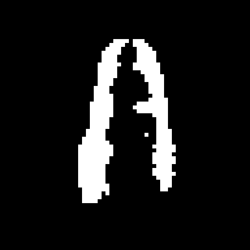 |  |

| endpoint_auto | rk2_auto |
| --- | --- |
|  |  |

| endpoint_gt | rk2_gt |
| --- | --- |
|  |  |

| rk2_n15_auto | rk2_n15_gt |
| --- | --- |
|  |  |

Scores below are this reviewer's ratings, not independent image assessments.

| Condition | Edit | Preservation |
| --- | ---: | ---: |
| endpoint_auto | 2 | 1 |
| rk2_auto | 2 | 1 |
| endpoint_gt | 2 | 2 |
| rk2_gt | 2 | 2 |
| rk2_n15_auto | 2 | 2 |
| rk2_n15_gt | 2 | 2 |

## synth_0033: head -> cat

A dog with cat head at a restaurant

Footprint: comparable. White mask cells are editable; these are control masks, not localization visualizations recomputed for the report.

| Source | Automatic control mask | GT-derived control mask |
| --- | --- | --- |
|  | 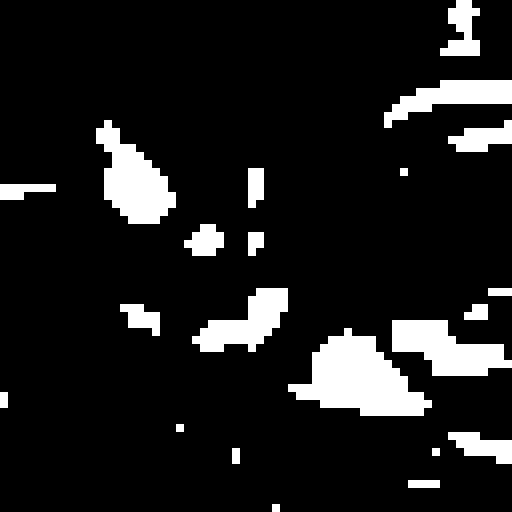 | 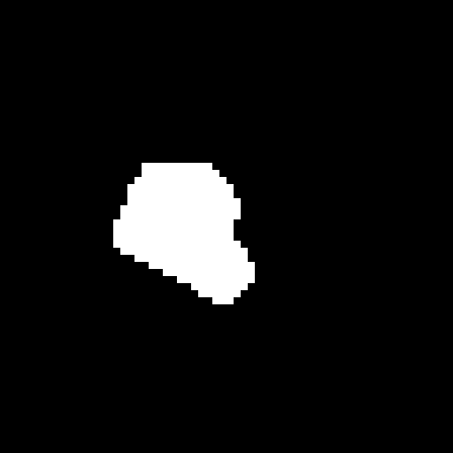 |

| endpoint_auto | rk2_auto |
| --- | --- |
|  |  |

| endpoint_gt | rk2_gt |
| --- | --- |
| 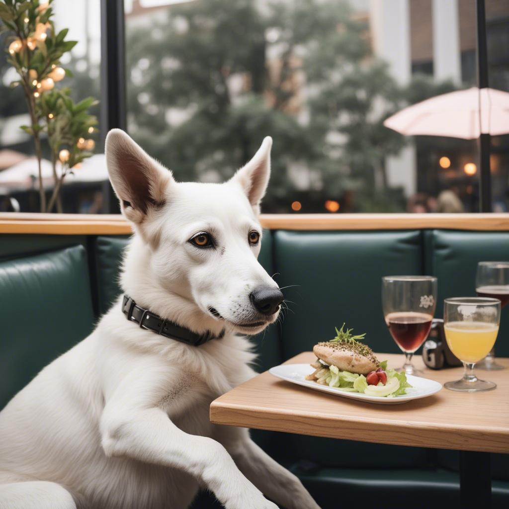 |  |

| rk2_n15_auto | rk2_n15_gt |
| --- | --- |
| 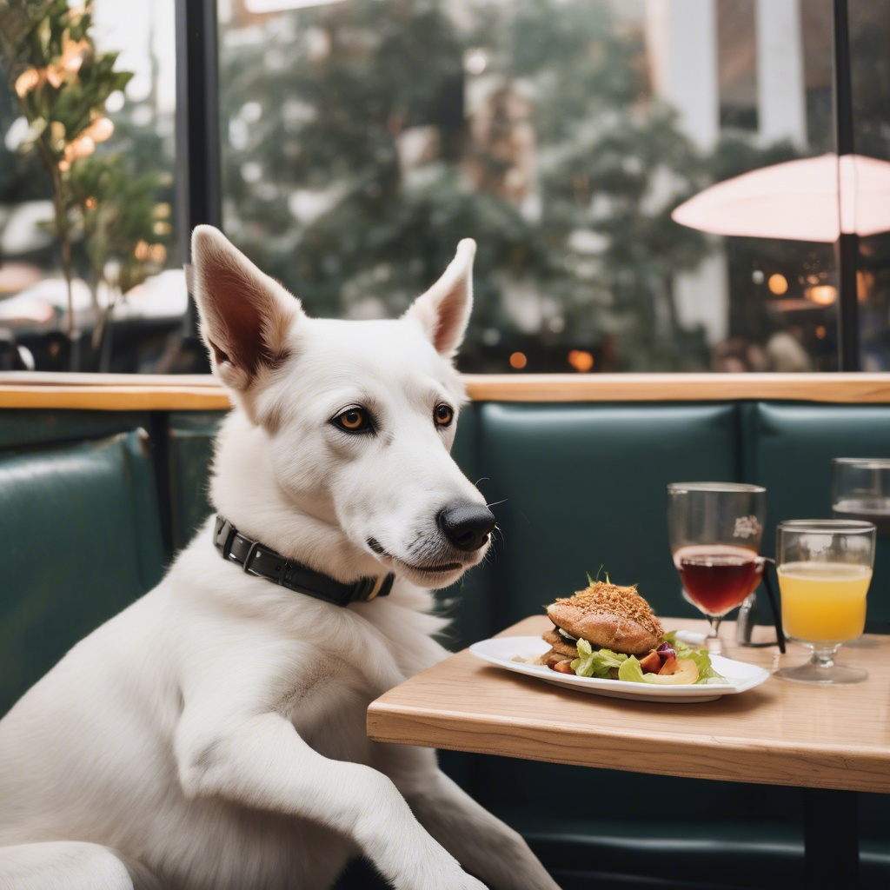 |  |

Scores below are this reviewer's ratings, not independent image assessments.

| Condition | Edit | Preservation |
| --- | ---: | ---: |
| endpoint_auto | 0 | 0 |
| rk2_auto | 0 | 0 |
| endpoint_gt | 0 | 2 |
| rk2_gt | 0 | 2 |
| rk2_n15_auto | 0 | 0 |
| rk2_n15_gt | 0 | 2 |

## synth_0038: head -> dragon

A horse with dragon head at a zoo

Footprint: expansion. White mask cells are editable; these are control masks, not localization visualizations recomputed for the report.

| Source | Automatic control mask | GT-derived control mask |
| --- | --- | --- |
| 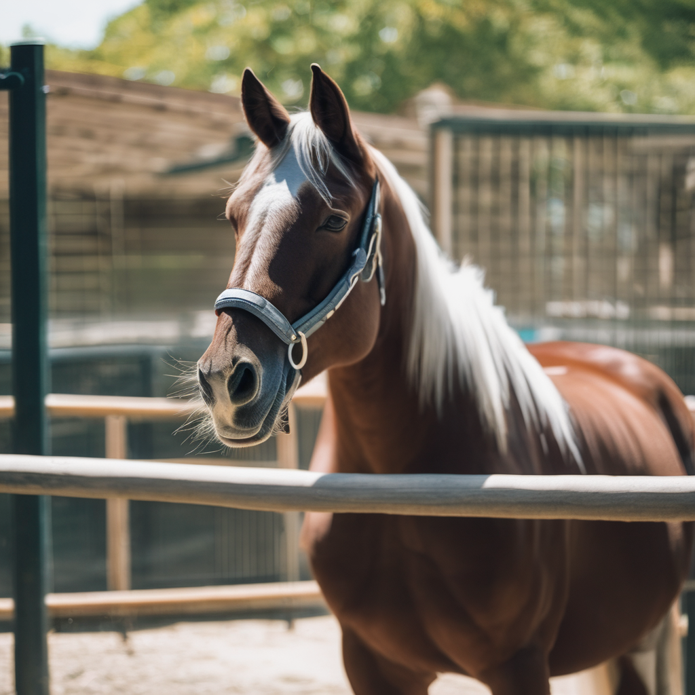 | 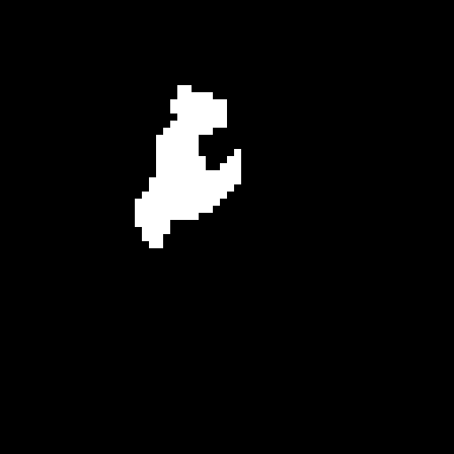 | 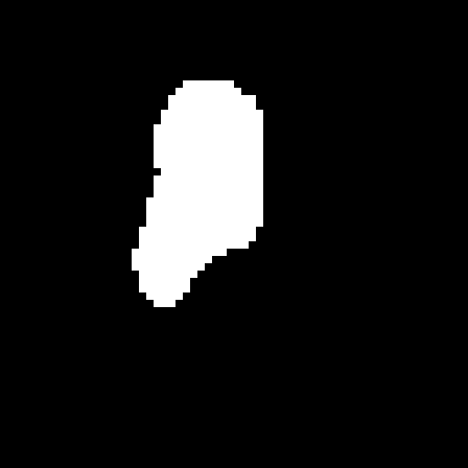 |

| endpoint_auto | rk2_auto |
| --- | --- |
| 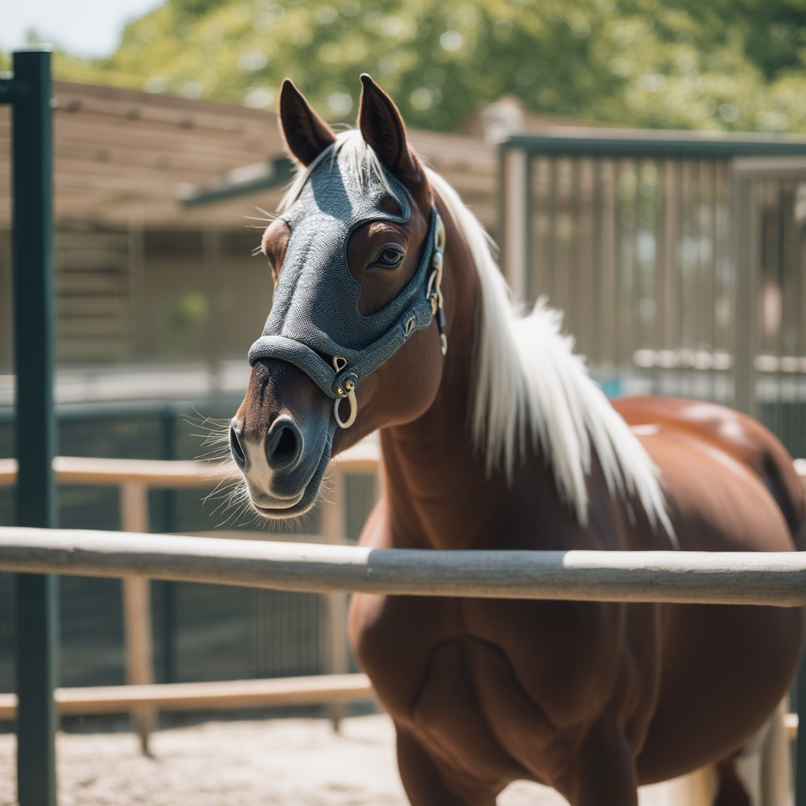 | 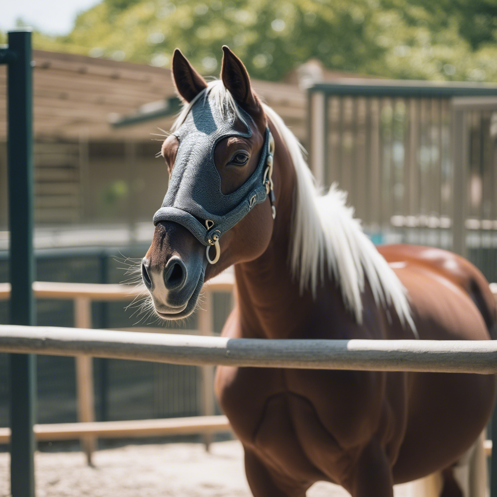 |

| endpoint_gt | rk2_gt |
| --- | --- |
| 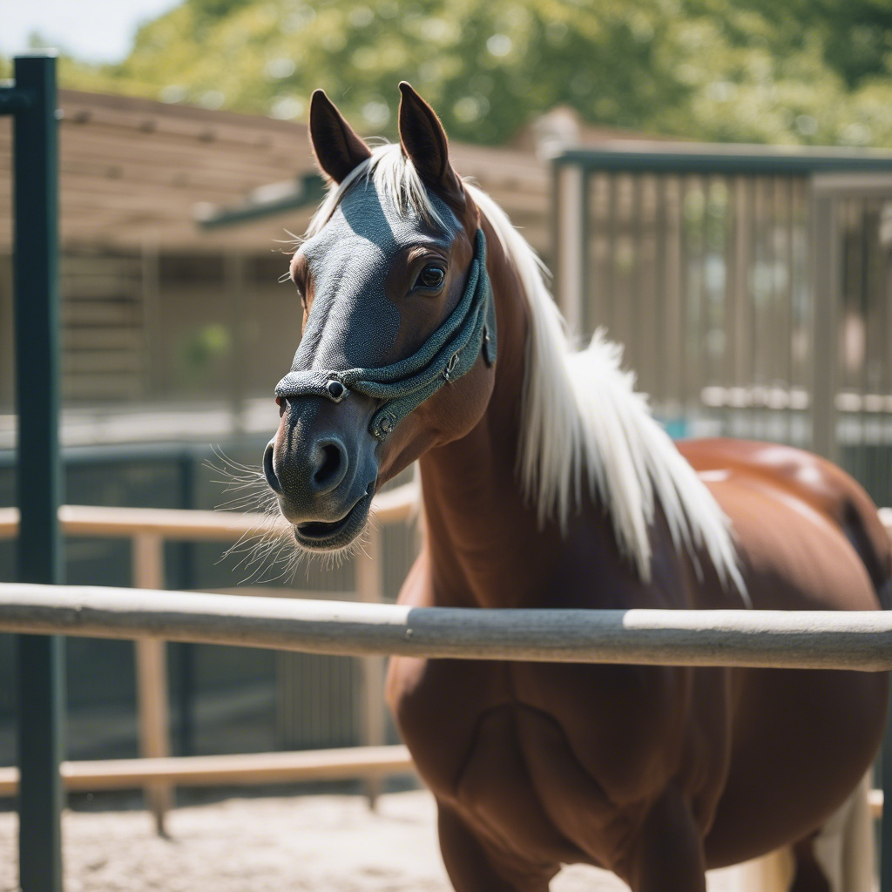 |  |

| rk2_n15_auto | rk2_n15_gt |
| --- | --- |
| 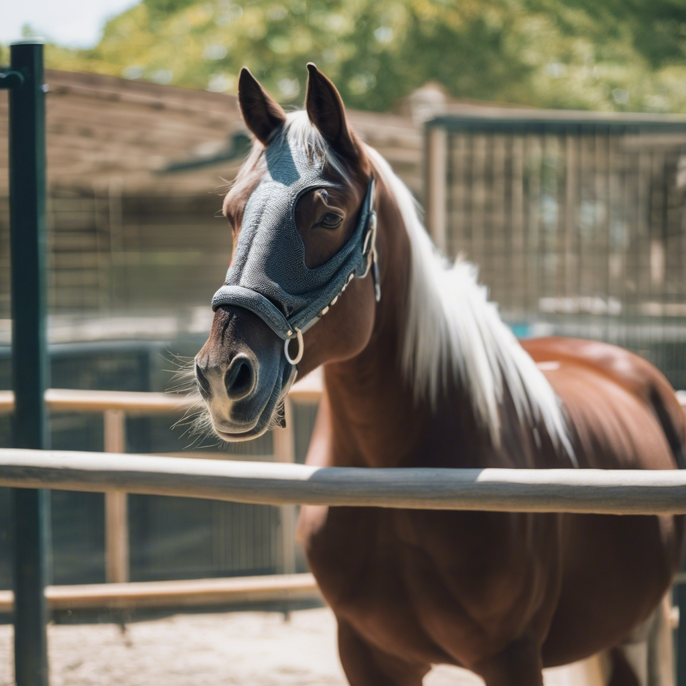 |  |

Scores below are this reviewer's ratings, not independent image assessments.

| Condition | Edit | Preservation |
| --- | ---: | ---: |
| endpoint_auto | 0 | 2 |
| rk2_auto | 0 | 2 |
| endpoint_gt | 0 | 2 |
| rk2_gt | 0 | 2 |
| rk2_n15_auto | 0 | 1 |
| rk2_n15_gt | 0 | 2 |


## Animal-head replacement: a specific weakness

A post-hoc part-category breakdown separates 18 animal-head cases from 10 humanoid-head cases (including humans, robots and aliens). Each case has all six conditions. The counts below use the current single reviewer's local-edit scores: 0 means failure, 1 partial success and 2 full success. They do not combine editing with preservation or treat repeated conditions as independent cases.

| Animal-head condition | Failed (0) | Partial (1) | Full (2) |
| --- | ---: | ---: | ---: |
| Endpoint, automatic mask, N=7 | 12 | 4 | 2 |
| Endpoint, GT mask, N=7 | 12 | 6 | 0 |
| RK2, automatic mask, N=7 | 11 | 4 | 3 |
| RK2, GT mask, N=7 | 14 | 4 | 0 |
| RK2, automatic mask, N=15 | 13 | 3 | 2 |
| RK2, GT mask, N=15 | 15 | 3 | 0 |

No animal-head case received a full local-edit score under any of the three GT conditions. For RK2 with GT, failure counts were 14/18 at N=7 and 15/18 at N=15. These results do not support treating better preservation as successful animal-head replacement. Reporting only the proportion scoring at least 1 would obscure the absence of full successes.

This weakness is not uniform across head edits: among the 10 humanoid-head cases, RK2 with GT at N=15 received seven full successes, one partial success and two failures. Part identity, requested transformation and footprint category are confounded in this dataset; the subgroup breakdown does not isolate which factor causes failure. These are descriptive, post-hoc observations from one reviewer, not independently validated subgroup superiority tests or a universal model capability boundary.

The [28-case head gallery](head_gallery.md) includes every head case, both actual control masks and all six outputs, using fixed automatic/GT columns. Exact counts and rates are in [head-class statistics](data/human_by_head_class.csv) and [all part categories](data/human_by_part.csv).

## Independent six-case diagnostic

The [six-case duration and initialization study](https://github.com/ptan853/part-level-tdm-localization/blob/a2ada77eb004759629424965290684dcf81eb63f/core/reports/gt_prefix_closeout/README.md) is a separate, failure-selected investigation. Its N=0..13 sweep and random-noise baseline are not pooled into this study. It reports unreliable head-body composition even without preservation control under its tested configuration, which motivates investigating semantic editability and initialization without claiming general FLUX incapability.

That study contains two distinct uncontrolled baselines. Inversion-initialized N=0 starts from the source inversion latent and samples with the target prompt, without the added spatial controls. Random-noise N=0 removes source inversion and starts from independent Gaussian noise. Both use the study's target prompts, 15-update RK2 schedule, target guidance 2.0 and seed 0. Neither is an exhaustive test of text-to-image capability across prompts, samplers or seeds.

The report's qualitative observations include a canine head remaining in the inversion-initialized dog-to-cat case, a separate kitten appearing on the dog's head in the random-noise version, and face coverings or armour rather than an unambiguous biological dragon head in the horse case. Some outcomes do contain the requested features: the cat-to-dragon inversion result also changes the body, and the bear-to-lion result develops a lion-like face and mane. These are failures of varying kinds, not evidence that target semantics are entirely absent in every image.

Taken together, the two studies weaken the explanation that inaccurate automatic masks or excessive preservation control alone account for the observed failures. Failure without control shows that such control is not necessary for failure in these tested examples; it does not show that control has no additional effect. The evidence instead motivates distinguishing target-feature generation, head-body semantic binding, inversion initialization and spatial support. It does not establish joint attention as the cause, prove that FLUX is incapable of these compositions, or explain the performance gap to PartEdit under unmatched settings.

The six-case observations were not independently blinded ratings and are not added to the current 59-case estimates, confidence intervals or animal-head success counts. A change in sampling configuration or prompt formulation would be a new exploratory comparison, not a correction to the frozen results.

## Provenance and reproduction

Generation execution commit: `5ab29c1d0785a94a10bcc119326c8294092f89c7`; FollowYourShape submodule: `b096e8f7736b0f44d820933d5046fe252059a5eb`. Generation registered 240 new commands and saved 237 images; three new outputs were safety-filtered. With 118 cached images, 355 outputs were available, but 354 from 59 common cases enter the paired analysis. The isolated extra output for synth_0014 is not silently added to one condition.

The [frozen protocol](../gt_mask_diagnostic_protocol.md) and [pre-launch record](../../protocols/gt_mask_diagnostic_v2/prelaunch_record.md) retain their historical wording. This report documents the post-generation rating deviation rather than rewriting those records. Full coverage: [coverage.csv](data/coverage.csv). New raw and corrected ratings plus the user-authorized correction are in `data/`. Prior-study ratings are not reused.

To recompute statistics, run the analysis command above with the archived local inputs. Automatic metrics were produced with `core/scripts/evaluate_gt_mask_diagnostic.py evaluate --output <new-directory>` on the GPU environment; existing output directories must not be overwritten. The generation commands remain in `core/protocols/gt_mask_diagnostic_v2/run_matrix.csv`. Large run artifacts and model weights are not bundled with this report, so regenerating images requires the recorded environment and inputs. Analysis source and input hashes are retained in `data/analysis_record.json`. The published report, galleries and analysis code are archived at commit `0137a18597ec8712543a59967a8777f72f52c600`; subsequent documentation cleanup does not alter those immutable links or the frozen generation commits.

## Conclusion

On this previously inspected split and conditional on one reviewer, better spatial support chiefly improves preservation, with contrasting behavior for comparable and expansion edits. The results do not support an RK2-specific advantage. N=15 strengthens preservation but does not establish improved semantic editing or an optimal duration. The single-reviewer deviation and comparative-image exposure should accompany any communication of these results.

Animal-head replacement is a particular weakness: none of the 18 cases was rated fully successful under the GT-mask conditions. Separate uncontrolled baselines also show unreliable head-body composition under their tested configuration, so improving localization or extending control alone is not yet a sufficient explanation or remedy. Humanoid-head edits perform better, and the available evidence supports a task-specific empirical limitation rather than a general inability of the backbone model.
