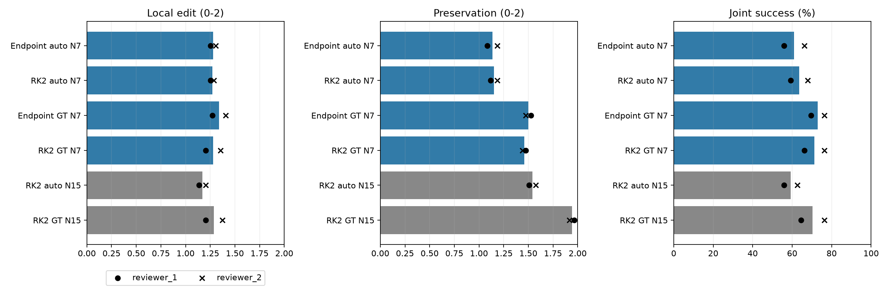

# GT-mask diagnostic: two-reviewer update

## Scope

59 paired cases, six conditions and two reviewers (708 image ratings). N=7 remains primary; RK2 N=15 remains supplementary. The unavailable synth_0014 case remains excluded. Generation outputs, frozen protocol and the original single-reviewer report are unchanged.

Ten initially missing scores across seven images were subsequently completed by the same second reviewer. No scores were imputed. Original exports and amendment records were retained.

Joint success means local edit >=1 AND preservation >=1 for an individual reviewer. Strict joint means both equal 2. These binary outcomes are computed before averaging reviewers.

## Human results

| Method | Local edit | Preservation | Prompt | Quality | Joint % | Strict joint % |
| --- | ---: | ---: | ---: | ---: | ---: | ---: |
| endpoint_auto | 1.280 | 1.136 | 1.517 | 2.000 | 61.017 | 14.407 |
| rk2_auto | 1.271 | 1.153 | 1.551 | 1.992 | 63.559 | 12.712 |
| endpoint_gt | 1.339 | 1.500 | 1.602 | 2.000 | 72.881 | 25.424 |
| rk2_gt | 1.280 | 1.458 | 1.602 | 2.000 | 71.186 | 26.271 |
| rk2_n15_auto | 1.169 | 1.542 | 1.593 | 1.992 | 59.322 | 28.814 |
| rk2_n15_gt | 1.288 | 1.941 | 1.653 | 2.000 | 70.339 | 54.237 |



Bars show the two-reviewer average; circles and crosses show reviewer-specific means. These markers show disagreement, not confidence intervals.

## Paired contrasts

10,000 paired case draws, seed 20260908, within size strata 20/19/20. Both reviewers and all methods stay together within each sampled case. Percentile 95% intervals are conditional on these two reviewers and are not multiplicity-adjusted. Joint differences are proportions.

| Contrast | Local edit [95% CI] | Preservation [95% CI] | Joint [95% CI] |
| --- | --- | --- | --- |
| Endpoint GT - auto | 0.059 [-0.068, 0.186] | 0.364 [0.220, 0.517] | 0.119 [0.025, 0.220] |
| RK2 GT - auto | 0.008 [-0.127, 0.153] | 0.305 [0.186, 0.432] | 0.076 [-0.017, 0.169] |
| RK2 - Endpoint (auto) | -0.008 [-0.110, 0.076] | 0.017 [-0.059, 0.093] | 0.025 [-0.034, 0.085] |
| RK2 - Endpoint (GT) | -0.059 [-0.136, 0.008] | -0.042 [-0.136, 0.051] | -0.017 [-0.068, 0.025] |
| Mask-by-controller interaction | -0.051 [-0.161, 0.059] | -0.059 [-0.169, 0.059] | -0.042 [-0.127, 0.042] |
| RK2 N15 - N7 (auto) | -0.102 [-0.195, -0.008] | 0.390 [0.263, 0.517] | -0.042 [-0.102, 0.017] |
| RK2 N15 - N7 (GT) | 0.008 [-0.076, 0.093] | 0.483 [0.373, 0.593] | -0.008 [-0.068, 0.051] |

## Reviewer agreement

| Criterion | Linear weighted kappa | Exact agreement |
| --- | ---: | ---: |
| local_edit_success_0_2 | 0.788 | 82.8% |
| non_target_preservation_0_2 | 0.688 | 80.8% |
| overall_prompt_adherence_0_2 | 0.504 | 75.7% |
| visual_quality_0_2 | 0.000 | 99.4% |

Agreement is descriptive over 354 paired outputs. Outputs share cases, so they are not 354 independent cases. Reviewer-level results and all disagreements are retained in reviewer_summary.csv, reviewer_paired_bootstrap.csv and disagreements.csv.

## Interpretation and limitations

At N=7, GT improves preservation versus auto for both controllers: Endpoint +0.364 [0.220, 0.517]; RK2 +0.305 [0.186, 0.432]. Local-edit differences remain uncertain: Endpoint +0.059 [-0.068, 0.186]; RK2 +0.008 [-0.127, 0.153]. Thus better mask quality helps preservation but does not, by itself, resolve semantic editing failures.

Endpoint GT increases joint success by 11.86 percentage points [2.54, 22.03]; RK2 GT increases it by 7.63 points [-1.69, 16.95]. RK2-versus-Endpoint intervals span zero for local edit, preservation and joint success under both mask types. These results do not establish RK2 superiority or equivalence.

Supplementary N=15 improves RK2 preservation with either mask. With auto masks, local edit decreases by 0.102 [-0.195, -0.008], while joint-success change remains uncertain. With GT, local-edit and joint-success changes also remain uncertain. Longer control is therefore not an established general improvement in joint editing utility.

Visual quality has 99.4% exact agreement but kappa=0: reviewer 2 assigns 2 to every output and reviewer 1 differs on only two. With such a ceiling, expected agreement is already very high. Kappa=0 here should not be read as widespread disagreement or used as strong evidence of a discriminative quality rubric.

The second reviewer evaluated the frozen outputs independently using the fixed rubric, with method identities concealed and without access to comparative montages, analysis reports, or the first reviewer's scores before or during evaluation. The first reviewer's prior exposure to comparative montages remains a potential source of bias. The initial single-reviewer analysis is retained as a documented deviation from the planned two-reviewer evaluation; the additional review does not remove these limitations.

GT marks the source part, not necessarily the required target footprint. Better preservation alone does not establish successful target semantics. Intervals spanning zero do not prove equivalence. Part and size analyses are descriptive, not independently powered subgroup claims.

Automatic measurements are reused without new GPU generation. Their summaries and paired intervals are included; adding a reviewer does not alter automatic measurements.

## Reproduce

From the repository root, in a Python environment with numpy, pandas and matplotlib:

```bash
python core/scripts/analyze_gt_diagnostic_two_reviewers.py --archived-inputs
```

The input archive supports statistical reproduction without GPU models or generated images. Archived mode checks image-role identifiers rather than machine-specific absolute paths; the original local analysis checked full path matches. To rerun against the original local review package, omit --archived-inputs. Source data and rating amendments are retained under inputs/.

Input hashes and confusion matrices: [analysis_record.json](analysis_record.json). Original report: [single-reviewer closeout](../README.md).
