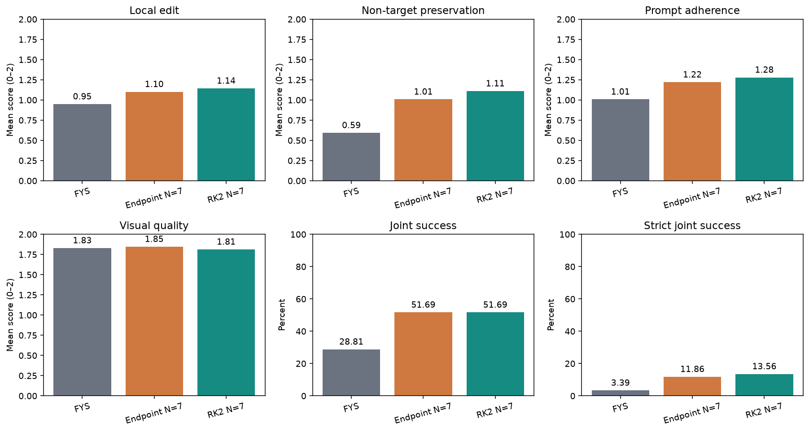
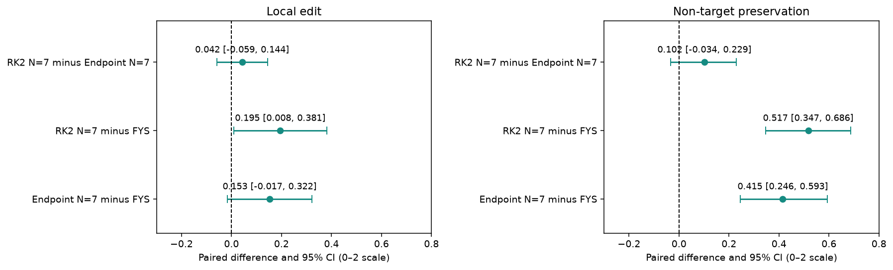
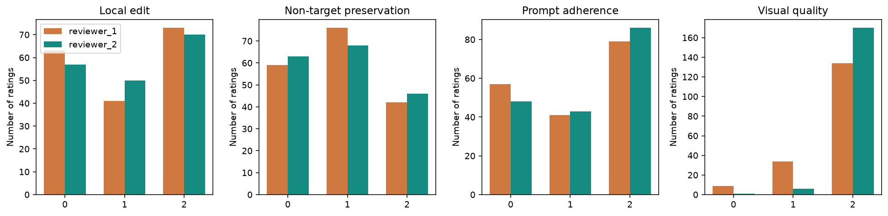
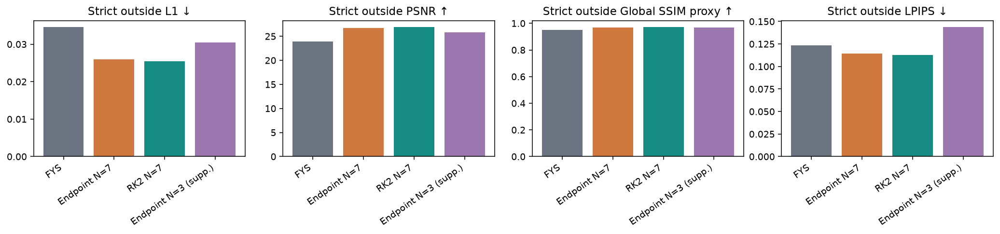
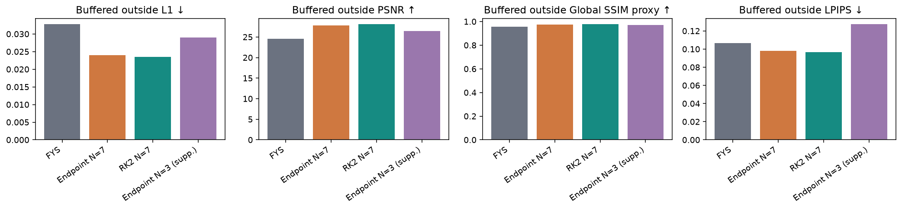
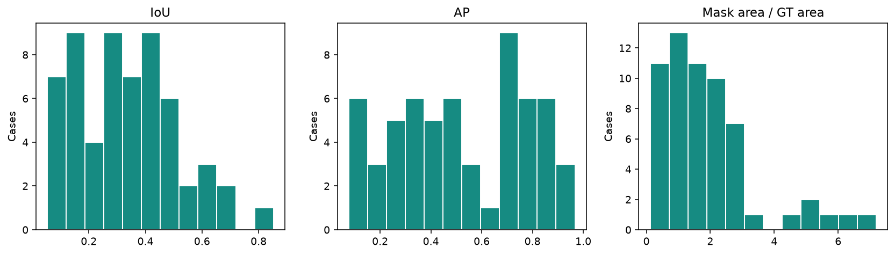
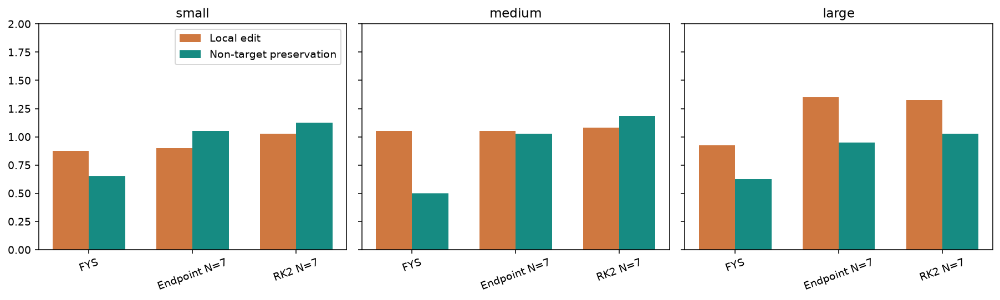
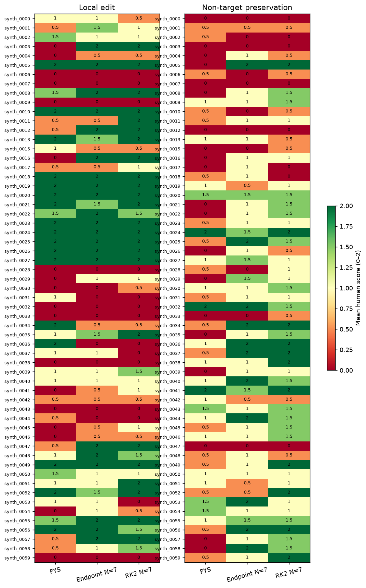
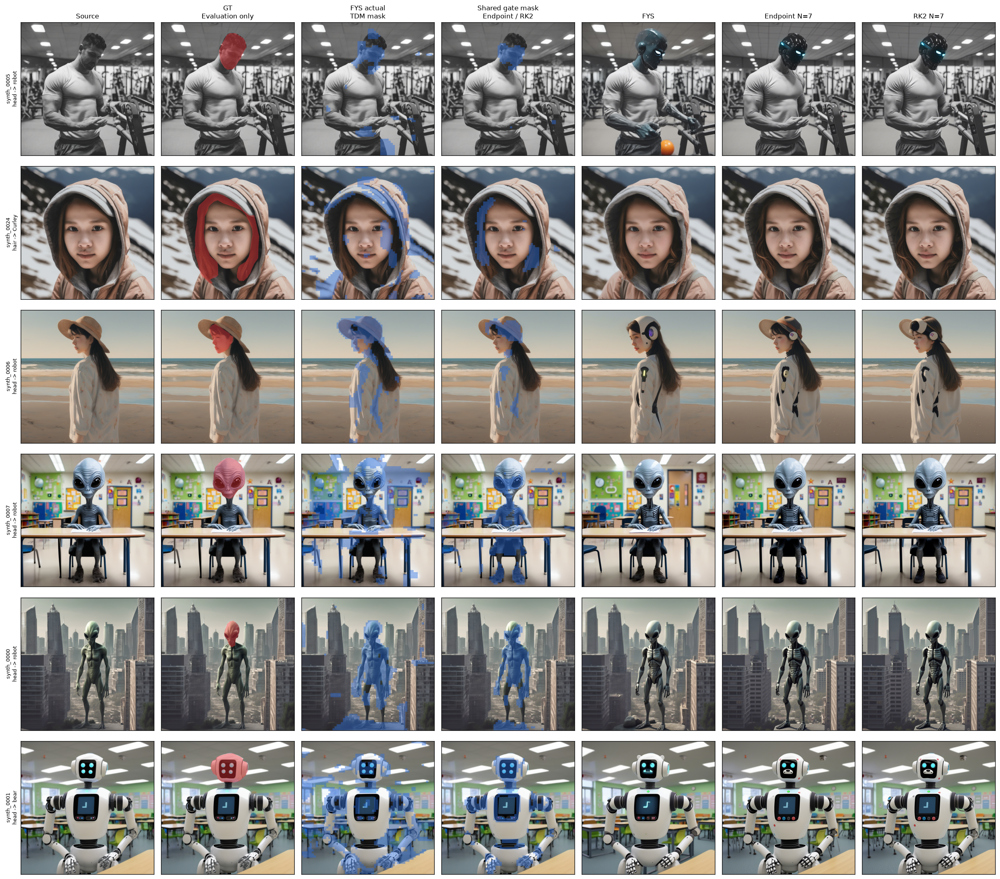

# Held-Out PartEdit Control Comparison: Results

**Analysis date:** 2026-09-08. **Scope:** 59 available cases from the registered 60-case synthetic split; two reviewers; three core methods. This is an available-case report, not a complete execution of the frozen 60-case primary analysis.

## 1. Finding

Both endpoint projection and source-referenced residual RK2 improve human-rated non-target preservation relative to native FYS. RK2 has slightly higher mean edit and preservation scores than endpoint projection, but the paired human preservation interval includes zero. The pre-registered requirement that RK2 outperform **both** baselines on preservation is therefore not met. This experiment does **not** establish the central RK2-superiority claim.

The matched endpoint-versus-RK2 comparison isolates the control operation. Comparisons with native FYS change the mask and schedule as well, and cannot attribute the improvement to control alone. Small automatic-metric advantages for RK2 do not override the human criterion.

## 2. Experimental Setup

The [frozen protocol](heldout_control_comparison_frozen_protocol.md) specified all 60 PartEdit-Bench `synth` cases, FLUX.1-dev, seed 0, 15 solver steps, and guidance 2.0. Generation used commit `085e8a3b930bfdf85da4bbbb198e83aede532e37`, with FollowYourShape submodule `b096e8f7736b0f44d820933d5046fe252059a5eb`. The manifest SHA-256 is `8e69fd42969286ce028c00c285a5a12600a5a4127e18a2c1f03d5ccbc3283147`.

| Condition                  | Mask and control                                                                                                      | Scoring                                |
| -------------------------- | --------------------------------------------------------------------------------------------------------------------- | -------------------------------------- |
| Original FYS-TDM           | Native TDM and three-stage source image-KV schedule                                                                   | Automatic and human                    |
| Endpoint N=7               | Shared automatic mask; endpoint projection at steps 0–6; free target denoising at steps 7–14; no image-KV injection | Automatic and human                    |
| Residual RK2 N=7           | Same mask and interval; midpoint and endpoint residual constraints; no image-KV injection                             | Automatic and human                    |
| Endpoint N=3, supplemental | Full source image-KV at steps 0–1; projection at steps 2–4; free denoising at steps 5–14                           | Automatic only; human scoring deferred |

N=3 is a historical operating point, **not a pure duration ablation**: timing and early image-KV use differ from N=7. The resolved configuration and frozen protocol specify the schedule above.

A separate forward FYS scout supplies the shared `part-attention × delta-v` gated mask. This is a static automatic mask, not an oracle GT mask and not an inversion-derived mask. Original FYS does not consume it. Native GT is used only for evaluation.

### Control equations

Let $M=1$ denote the editable region, $x_i$ the edited latent, and $s_i$ the time-aligned inversion reference. Write $h_i=t_{i+1}-t_i$ for the signed denoising time increment and $t_{i+1/2}=(t_i+t_{i+1})/2$. The reference $s_{i+1/2}$ is the intermediate latent saved during the corresponding inversion RK2 step, indexed in reverse order for denoising; it is not the arithmetic mean of the reference endpoints. All products with $M$ are elementwise, broadcast over latent channels. Endpoint projection acts after the target solver update $\widetilde{x}_{i+1}$:

$$
x_{i+1}=M\odot\widetilde{x}_{i+1}+(1-M)\odot s_{i+1}.
$$

Residual RK2 represents $d_i=x_i-s_i$ and applies the mask to residual increments at both solver evaluations:

$$
v_1=v_\theta(x_i,t_i,c_{\mathrm{tgt}}),
$$

$$
d_{i+1/2}=d_i+M\odot\left[\frac{h_i}{2}v_1-(s_{i+1/2}-s_i)\right],\quad x_{i+1/2}=s_{i+1/2}+d_{i+1/2},
$$

$$
v_2=v_\theta(x_{i+1/2},t_{i+1/2},c_{\mathrm{tgt}}),
$$

$$
d_{i+1}=d_i+M\odot[h_i v_2-(s_{i+1}-s_i)],\quad x_{i+1}=s_{i+1}+d_{i+1}.
$$

With zero initial residual outside the mask, the controlled prefix remains on the reference trajectory there. This guarantee ends when the prefix control is released; later denoising can alter non-target content.

## 3. Coverage and Deviations

All 300 commands completed and the runner exited with code 0. There are 295 saved images: 59 scouts and 236 evaluated outputs. For `synth_0014`, all five logs show completed denoising/decoding followed by `Your generated image may contain NSFW content.` The safety filter prevented final-image saving. The record is retained; no selective rerun or zero-score imputation was performed. The classifier message does not establish whether the content was actually unsafe.

| Population                          |   Registered |     Available / completed |
| ----------------------------------- | -----------: | ------------------------: |
| Cases                               |           60 | 59 with evaluable outputs |
| Core-method images                  |          180 |                       177 |
| Supplemental N=3 images             |           60 |                        59 |
| Human ratings, including supplement |          480 |   354 core-method ratings |
| Small / medium / large cases        | 20 / 20 / 20 |              20 / 19 / 20 |

The missing case creates a post-generation available-case subset. No missingness assumption is used to claim that it represents the complete registered population. The missing record is retained in coverage reporting and the complete gallery.

Review pages retained single-candidate display, opaque IDs and frozen relative order. Source prompts and Chinese rubric explanations/examples were added after generation. Human evaluation of supplemental N=3 was deferred, leaving 177 core outputs per reviewer. These departures from the original 240-item-per-reviewer display plan are documented here; the original protocol remains unchanged. Existing scores were not adjudicated or edited during analysis. Reviewers were instructed to work independently, but CSVs alone cannot verify independence or previous exposure to method summaries.

All 354 submitted image pairs were checked by SHA-256 against their source and generated files; prompts matched the manifest. Source files originate from the dataset's `original_image` field, not its PartEdit reference outputs. No source/candidate reversal was found.

## 4. Human Results

Scores range from 0 to 2. Joint success means local edit and preservation are both at least 1 **for a reviewer**; strict joint requires both equal 2. Rates pool those reviewer-level judgments, rather than thresholding a mean rating.

| Method       | Local edit | Preservation | Prompt adherence | Visual quality | Joint | Strict joint |
| ------------ | ---------: | -----------: | ---------------: | -------------: | ----: | -----------: |
| FYS          |      0.949 |        0.593 |            1.008 |          1.831 | 28.8% |         3.4% |
| Endpoint N=7 |      1.102 |        1.008 |            1.220 |          1.847 | 51.7% |        11.9% |
| RK2 N=7      |      1.144 |        1.110 |            1.280 |          1.814 | 51.7% |        13.6% |



The two control methods have the same pooled joint rate. RK2's slightly higher strict joint rate does not make it an unambiguous winner, and no alternative outcome replaces the registered criterion.

### Paired uncertainty and success criteria

Bootstrap resampling draws cases with replacement within the available size strata (20/19/20), keeping all methods and both reviewers together. There are 10,000 draws, seed `20260903`. These intervals describe case uncertainty conditional on the two supplied reviewers; they do not estimate a population of reviewers. Metric-specific percentile intervals are not corrected for multiple comparisons.

| Contrast        | Local-edit difference [95% CI] | Preservation difference [95% CI] |
| --------------- | ------------------------------ | -------------------------------- |
| Endpoint − FYS | 0.153 [−0.017, 0.322]         | 0.415 [0.246, 0.593]             |
| RK2 − FYS      | 0.195 [0.008, 0.381]           | 0.517 [0.347, 0.686]             |
| RK2 − Endpoint | 0.042 [−0.059, 0.144]         | 0.102 [−0.034, 0.229]           |



Applying the registered numerical thresholds to the available-case analysis:

- **Preservation superiority: not met.** The RK2-minus-endpoint lower bound is below zero.
- **Local-edit non-inferiority: met.** Endpoint is the stronger local-edit baseline; the lower bound −0.059 is above the −0.20 margin.
- **Joint utility: met as a point-estimate condition.** RK2 exceeds FYS by 22.9 percentage points and equals endpoint.
- **All primary criteria: not met.** This is also not a complete 60-case primary analysis.

### Reviewer agreement

| Criterion        | Linear weighted κ | Exact agreement |
| ---------------- | -----------------: | --------------: |
| Local edit       |              0.702 |           74.6% |
| Preservation     |              0.439 |           59.9% |
| Prompt adherence |              0.556 |           67.2% |
| Visual quality   |              0.080 |           74.6% |



Visual-quality ratings are concentrated at the ceiling: reviewer 2 gave 170/177 images a 2, versus 134/177 for reviewer 1. The small between-method quality differences should therefore not support a strong quality-ranking claim. Consensus joint success, requiring both reviewers to pass, is 15.3% for FYS, 39.0% for endpoint, and 40.7% for RK2; consensus strict joint is 1.7%, 5.1%, and 6.8%, respectively.

## 5. Automatic Metrics

Metrics compare source and output at 512×512; saved generation images are 1024×1024. Strict non-target regions are outside native GT; buffered regions exclude a 32-pixel-radius GT dilation. SSIM here is the existing global selected-pixel proxy, not standard local-window SSIM. LPIPS uses the archived masked AlexNet implementation. All 236 available outputs have finite strict and buffered LPIPS values.

| Method                     | Strict L1 ↓ | Strict PSNR ↑ | Strict SSIM proxy ↑ | Strict LPIPS ↓ | Buffered LPIPS ↓ |
| -------------------------- | -----------: | -------------: | -------------------: | --------------: | ----------------: |
| FYS                        |      0.03456 |          23.89 |              0.95044 |         0.12353 |           0.10676 |
| Endpoint N=7               |      0.02598 |          26.71 |              0.96979 |         0.11424 |           0.09824 |
| RK2 N=7                    |      0.02550 |          26.90 |              0.97138 |         0.11270 |           0.09665 |
| Endpoint N=3, supplemental |      0.03045 |          25.84 |              0.96713 |         0.14371 |           0.12735 |




RK2-minus-endpoint strict LPIPS is −0.00154, CI [−0.00272, −0.00045]. This is a small consistent numerical advantage, while the corresponding human-preservation interval includes zero. RK2-minus-FYS strict LPIPS is −0.01083, CI [−0.02063, −0.00096]. Supplemental N=3 has worse LPIPS than FYS despite better L1/PSNR, so no single preservation metric should determine the conclusion.

Inside-mask activity measures are included in the notebook and exported tables. They quantify change relative to the source; they are not semantic edit-success measures.

## 6. Localization, Subgroups and Cases

The common scout mask is counted once per case. Across the 59 available cases, mean IoU is 0.336, AP is 0.522, and mask-area/GT-area ratio is 1.941; medians are 0.333, 0.492 and 1.688. Mask imprecision remains a plausible constraint, but these observations do not establish it as the sole cause of editing failures.




Size and footprint analyses are descriptive. The registered footprint distribution contains only one contraction case, so it cannot support general conclusions about shrinking parts. Per-case human scores are shown below; each cell is the mean of two ratings.

RK2's mean preservation score exceeds endpoint in all three size strata, but joint success is lower for small parts (55.0% versus 57.5%) and large parts (47.5% versus 52.5%), and higher for medium parts (52.6% versus 44.7%). Thus the aggregate tie in joint success hides heterogeneous outcomes. For the 13 expansion cases, RK2 preservation is 1.50 versus endpoint's 1.35, while joint success is 46.2% versus 50.0%. This is consistent with a preservation/editing tradeoff, not evidence that fixed-mask control resolves expansion editing.



Illustrative examples use a deterministic, explicitly post-score selection rule: lowest-index RK2 strict-consensus successes, local-edit failures and mixed/other outcomes (up to two per category). They are not additional evidence or a tuned test set. Their IDs are saved in `final_analysis/qualitative_selection.csv`.

The panels show source, evaluation GT, actual FYS TDM mask, shared automatic gate mask, and the three generated outputs. Red denotes GT; blue denotes actual binary edit support. FYS uses its own saved `selected_binary_tdm_mask.npy`; Endpoint and RK2 share the scout's `hybrid_binary_tdm_attention.npy`. These are the saved generation masks, not newly estimated masks. Nearest-neighbor resizing preserves their binary boundaries; GT is not used for generation.



In `synth_0005` (robot head), all methods produce a visible head change, but FYS also alters the hands/body and introduces a bright object; the two controlled outputs retain more source detail. In `synth_0006`, the requested robot-head change is not clearly realized: headset-like elements and clothing changes appear instead. In `synth_0007`, the alien-like head remains despite the robot-head request. Endpoint and RK2 often look very similar, as in these failure cases. `synth_0024` belongs to the success category according to both submitted ratings; its hair change is visually subtle, so the category is explicitly a rating-based label rather than a new objective success judgment.

The complete galleries preserve dataset order and visibly mark the missing output: [cases 0–19](assets/heldout_control_comparison/all_cases_1.jpg), [cases 20–39](assets/heldout_control_comparison/all_cases_2.jpg), [cases 40–59](assets/heldout_control_comparison/all_cases_3.jpg). The [indexed 60-case gallery](assets/heldout_control_comparison/all_cases.md) also provides individual, full-width case figures with target prompts. Case `synth_0014` retains its source, GT and saved intermediate masks; its three final outputs are explicitly marked unavailable. This visualization does not add that case to the 59-case outcome analysis.

## 7. Reproduction and Artifacts

Generation was performed on an A800 80 GB using Python 3.10.8, PyTorch 2.1.2+cu118 and offloading. Observations place the serial run at approximately nine hours on 2026-09-07; periodic GPU readings around 25 GB are not a measured peak-memory benchmark. The server environment is archived at `core/results/heldout_control_comparison/runtime_environment.json`. Per-run commands/configurations and logs are retained with the outputs.

On a clean checkout of the recorded generation commit, with dataset and model setup from the [scripts README](../scripts/README.md):

```bash
python core/scripts/run_heldout_control_comparison.py \
  --manifest core/data/partedit_subset/synth_60_frozen_manifest.json \
  --seeds 0 --attention-token-mode part --include-endpoint-n3 \
  --execution-commit 085e8a3b930bfdf85da4bbbb198e83aede532e37 --execute
```

Use empty output directories for a new reproduction. This command is not an instruction to rerun the missing case selectively. Noninteractive execution must inherit the configured local model caches; the first launch encountered a cache/environment lookup failure before producing an image and was restarted with explicit cache settings. No frozen numerical setting was changed.

LPIPS and other image metrics were computed on the GPU using the frozen `evaluate_rows` implementation. The archived available-output entry point and CSVs are under `available_output_evaluation/`; four missing metric rows remain null in `evaluation_metrics_all_records.csv`. The original full-output evaluation CLI intentionally rejects incomplete runs and is not presented here as having succeeded unchanged.

With the downloaded results and both raw core-review CSVs in their existing folders, rerun all postprocessing on Mac:

```bash
.venv/bin/python core/scripts/summarize_heldout_available_cases.py
.venv/bin/python -m jupyter nbconvert --execute --to notebook --inplace \
  core/notebooks/11_evaluate_heldout_control_comparison.ipynb
```

The new analysis entry point is post-generation tooling; the generation commit remains the immutable reference above. The array bootstrap implementation is tested against the frozen pandas implementation for identical RNG ordering and intervals. It does not change the resampling unit or thresholds.

The analysis release is commit `ab2931b79edf68f885c318c5c148f6b52296b89b`, containing the analysis script, executed notebook, figures and evidence snapshot. Use this revision for postprocessing, rather than the earlier generation-only commit. This version reference is recorded in a subsequent documentation-only commit.

The [analysis evidence snapshot](assets/heldout_control_comparison/evidence/README.md) includes reviewer-level scores, per-output automatic measurements, summary tables and confidence intervals. These files support numerical inspection independently of local result paths. Full image-level verification and notebook execution additionally require the original result bundle and dataset; these large inputs are not distributed with this report. The generation commit alone does not contain this later analysis release.

- [Notebook](../notebooks/11_evaluate_heldout_control_comparison.ipynb): full tables, CIs, human distributions, subgroups and complete image gallery.
- `core/results/heldout_control_comparison/final_analysis/`: all summary CSVs, per-case human scores, source/candidate hash audit, input checksums, coverage and criterion status.
- `two_reviewer_core_analysis/reviewer_1_core_scores.csv` and `reviewer_2_core_scores.csv`: verbatim submitted ratings; method mappings remain separate from the blinded pages.
- `blinded_review_available_outputs/`: local scoring pages, original opaque IDs and order, plus records of unavailable review assignments.

## 8. Conclusion

Both control strategies improved non-target preservation over original FYS on the 59 available cases. RK2 achieved higher mean human local-edit and preservation scores than endpoint projection, but the paired confidence intervals did not establish superiority over endpoint projection on either measure. The full set of prespecified success criteria was not met. These results support further investigation of trajectory-based control, while leaving the relative contributions of mask quality and the control mechanism unresolved.
