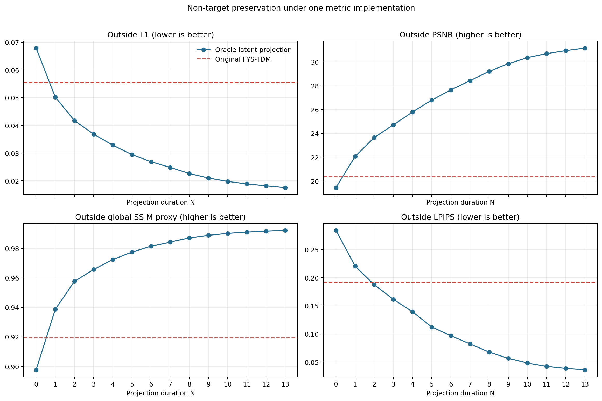
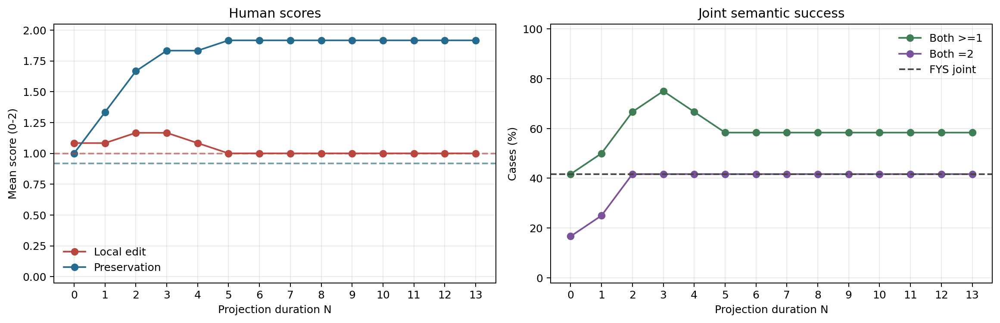
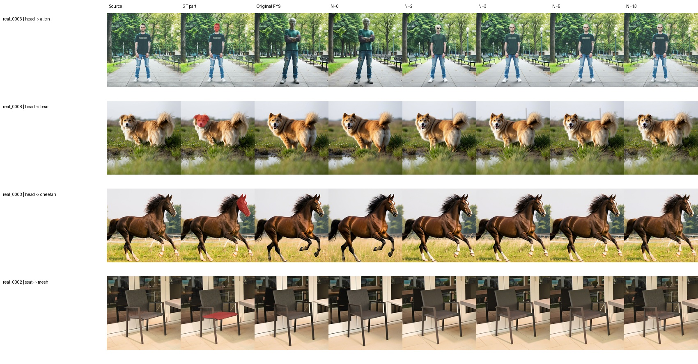
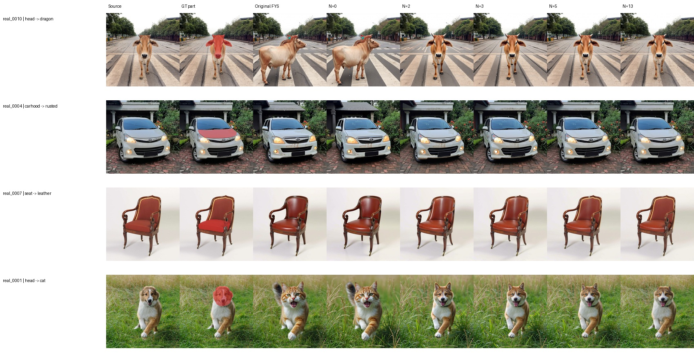
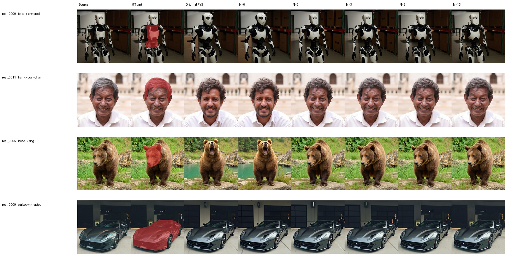

# Latent-State Projection Duration Study

## Objective

This experiment tests whether the control operation, rather than mask estimation alone, is a bottleneck in part-level editing. It compares the original FYS-TDM pipeline with an oracle-mask latent-state projection sweep over 12 locked cases.

## Control Strategy

The source image is inverted once to obtain aligned source states. Target-prompt denoising then follows the same 15-step schedule. For projection duration `N`, beginning at denoising step 2 and continuing for `N` consecutive steps:

```text
z_next = M_gt * z_target_next + (1 - M_gt) * z_source_aligned
```

Inside the GT part mask, the target trajectory is retained. Outside the mask, the state is projected back to the aligned source inversion state. `N=0` is the unprojected target-trajectory control. The experiment varies only `N`; the manifest, prompts, model, guidance, step count, and seed are fixed.

This is an oracle control-operation study. It does not claim automatic mask estimation.

## Evaluation Protocol

- 12 unique cases balanced across small, medium, and large parts.
- Original FYS is evaluated on 12 unique seed-0 outputs; the three stored seeds are identical and are not independent samples.
- Projection is evaluated at all durations `N=0..13`, producing 168 unique outputs.
- Image metrics use the exact implementation shared with notebooks 03 and 05.
- Human evaluation separates local semantic success from non-target preservation on a 0-2 rubric.

### Localization Diagnostic

Original FYS-TDM has mean IoU `0.172`, mean AP `0.240`, and mean predicted/GT area ratio `8.53`. Localization metrics are not assigned to oracle projection because its GT support is given rather than predicted.

## Quantitative Comparison

| Method | outside L1 ↓ | outside PSNR ↑ | outside SSIM ↑ | outside LPIPS ↓ | inside L1 | local edit ↑ | preservation ↑ | joint success ↑ |
|---|---:|---:|---:|---:|---:|---:|---:|---:|
| Original FYS-TDM | 0.056 | 20.36 | 0.919 | 0.191 | 0.117 | 1.000 | 0.917 | 41.7% |
| Oracle projection N=0 | 0.068 | 19.46 | 0.898 | 0.284 | 0.121 | 1.083 | 1.000 | 41.7% |
| Oracle projection N=2 | 0.042 | 23.66 | 0.958 | 0.188 | 0.093 | 1.167 | 1.667 | 66.7% |
| Oracle projection N=3 | 0.037 | 24.72 | 0.966 | 0.162 | 0.090 | 1.167 | 1.833 | 75.0% |
| Oracle projection N=5 | 0.029 | 26.79 | 0.977 | 0.112 | 0.087 | 1.000 | 1.917 | 58.3% |
| Oracle projection N=13 | 0.018 | 31.15 | 0.992 | 0.036 | 0.081 | 1.000 | 1.917 | 58.3% |

Inside L1 is descriptive edit activity, not semantic quality. Human local-edit scores determine whether a visible change realizes the requested edit.



## Human Semantic Evaluation



N=3 gives the strongest observed compromise: local-edit score `1.167/2`, preservation `1.833/2`, and joint success `75.0%`. Longer projection continues to improve pixel and perceptual preservation, but does not improve semantic realization. From N=0 to N=13, outside L1 falls by `74.2%`, while the human local-edit mean falls from `1.083` to `1.000`.

## Qualitative Results

### Small parts



### Medium parts



### Large parts



## Findings

1. State projection provides substantially stronger non-target preservation than N=0 and, from N=2 onward, improves the mean outside-region metrics over original FYS.
2. The gain is monotonic for preservation but not for semantic editing. Stronger/longer projection can suppress the requested local transformation.
3. N=2 and N=3 are the useful pilot candidates; N=5 is a preservation-dominant ablation.
4. A correct oracle support mask is not sufficient for reliable part semantics. The remaining failures implicate the target generation/control dynamics, not only localization.

## Limitations

- 12 cases and one human reviewer.
- Human assessments are complete for all 168 projection outputs.
- The deterministic path provides no seed uncertainty despite three configured seed labels in earlier experiments.
- The repository's global SSIM is a selected-pixel proxy, not windowed SSIM.
- Outside LPIPS neutralizes the GT interior to match the established project protocol.

## Reproduction

Generate the complete duration sweep:

```bash
python core/scripts/run_latent_projection_duration_sweep.py \
  --manifest core/data/partedit_subset/pilot_12_manifest.json \
  --all-cases \
  --durations 0-13 \
  --execute
```

Compute all image metrics, requiring GPU LPIPS:

```bash
TORCH_HOME=/path/to/torch_cache python core/scripts/evaluate_latent_projection_against_fys.py --lpips require
```

Then execute [`09_evaluate_latent_projection_duration_sweep.ipynb`](../notebooks/09_evaluate_latent_projection_duration_sweep.ipynb). Full environment and model setup remain in the repository README.
