# Source-Referenced Residual RK2 Prefix Control

## Objective

This experiment tests whether source-referenced residual integration can preserve non-target content without suppressing the requested local edit. It uses the same frozen 12-case PartEdit subset and the same Original FYS-TDM baseline as the earlier studies, but evaluates a new control operation across every global prefix duration `N=0..15`.

The experiment assumes an oracle GT part mask. It isolates the control mechanism under accurate localization; it does not claim to solve automatic mask extraction.

## Method

Let $s_i$, $s_{i+\frac{1}{2}}$, and $s_{i+1}$ be time-aligned source-inversion states. For the current edited state $x_i$, define the source-referenced residual

$$
d_i = x_i - s_i.
$$

Let $h=t_{i+1}-t_i$ be the signed denoising step size and $M$ the oracle edit mask on packed image tokens. A controlled midpoint RK2 step is

$$
d_{i+\frac{1}{2}}
=d_i+M\odot\left[\frac{h}{2}v_1-\left(s_{i+\frac{1}{2}}-s_i\right)\right],
\qquad
x_{i+\frac{1}{2}}=s_{i+\frac{1}{2}}+d_{i+\frac{1}{2}},
$$

$$
d_{i+1}
=d_i+M\odot\left[hv_2-\left(s_{i+1}-s_i\right)\right],
\qquad
x_{i+1}=s_{i+1}+d_{i+1}.
$$

Here $v_1=v_\theta(x_i,t_i,c_{tgt})$ and $v_2=v_\theta(x_{i+\frac{1}{2}},t_{i+\frac{1}{2}},c_{tgt})$. Outside the mask, an initially zero residual remains on the aligned source trajectory. Inside the mask, an all-one mask recovers the ordinary target-prompt midpoint RK2 update. The control is therefore applied consistently at both the endpoint and midpoint evaluations rather than projecting only the completed endpoint state.

`N=0` is the uncontrolled target trajectory. For `N>0`, residual control is applied to steps `0..N-1`. Image-KV injection is disabled, so the sweep measures only the residual-state control operation.

## Frozen Evaluation

- Dataset: 12 frozen cases, balanced across small, medium, and large target parts.
- Sweep: all 16 global durations, `N=0..15`.
- Outputs: 192 unique images (`12 cases x 16 durations`) at seed 0.
- Mask: projected oracle GT part mask.
- Baseline: Original FYS-TDM under the same image-metric and human-scoring definitions.
- Non-target preservation: outside-mask L1, PSNR, global-SSIM proxy, and LPIPS.
- Target-region activity: inside-mask L1, PSNR, and global-SSIM proxy; these are descriptive and do not measure semantic success.
- Human evaluation: independent 0-2 scores for local-edit success and non-target preservation.
- Joint success: both human scores are at least 1; strict joint success requires both scores to equal 2.
- Selection: one global `N` for all cases; no case-specific tuning.

## Results

### Complete Duration Sweep

#### Automatic image metrics

| N | Outside L1 ↓ | Outside PSNR ↑ | Outside SSIM ↑ | Outside LPIPS ↓ | Inside L1 |
|---:|---:|---:|---:|---:|---:|
| 0 | 0.1511 | 14.10 | 0.6820 | 0.4707 | 0.1769 |
| 3 | 0.0529 | 21.60 | 0.9302 | 0.2294 | 0.1352 |
| 5 | 0.0383 | 24.28 | 0.9623 | 0.1666 | 0.1280 |
| 7 | 0.0304 | 26.29 | 0.9751 | 0.1162 | 0.1257 |
| 9 | 0.0254 | 27.97 | 0.9828 | 0.0849 | 0.1230 |
| 15 | 0.0179 | 30.61 | 0.9914 | 0.0377 | 0.1198 |

The table lists representative checkpoints, while Notebook 10 contains all 16 rows. Every outside-region metric improves monotonically as the controlled prefix becomes longer. From `N=0` to `N=15`, outside L1 falls by 88.1%, PSNR rises by 16.51 dB, and LPIPS falls by 92.0%. The inside-region change decreases much more slowly, indicating that longer control mainly removes non-target drift rather than erasing all target activity.

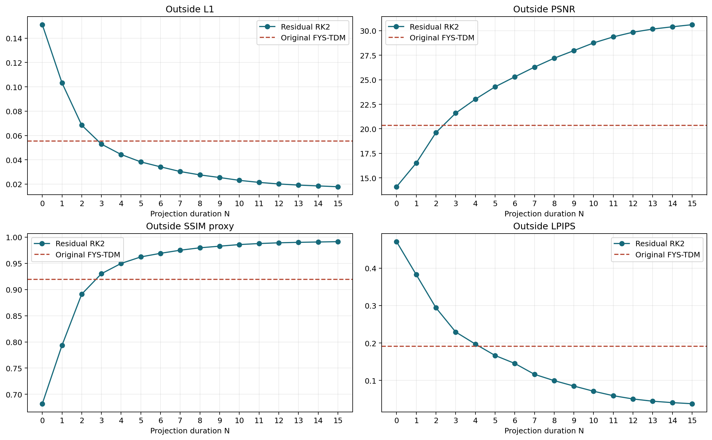

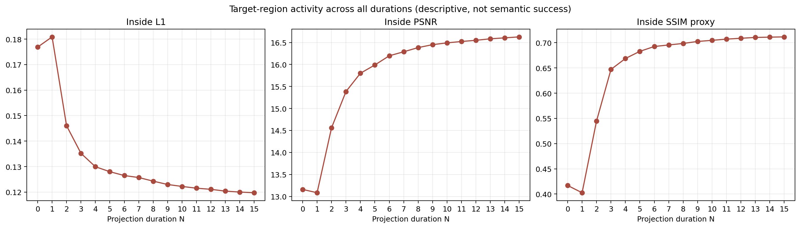

#### Human semantic evaluation

| N | Local edit ↑ | Preservation ↑ | Joint success ↑ | Strict joint ↑ |
|---:|---:|---:|---:|---:|
| 0 | 1.500 | 0.167 | 16.7% | 0.0% |
| 3 | 1.500 | 0.833 | 66.7% | 8.3% |
| 5 | 1.583 | 1.750 | 91.7% | 50.0% |
| 7 | 1.667 | 1.917 | 91.7% | 66.7% |
| 9 | 1.667 | 2.000 | 91.7% | 75.0% |
| 15 | 1.667 | 2.000 | 91.7% | 75.0% |

`N=5` is the first duration reaching the maximum observed joint-success rate. Local-edit success reaches its maximum mean at `N=7`, while preservation is already 1.917/2. Preservation reaches its 2.000/2 plateau at `N=9`, with no aggregate loss in local-edit score through `N=15`.

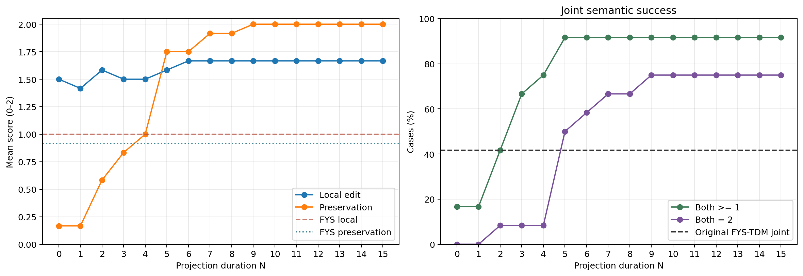

## Part Size And Per-Case Behavior

At the balanced `N=7` setting:

| Part size | Local edit ↑ | Preservation ↑ | Joint success ↑ |
|---|---:|---:|---:|
| Small | 1.50 | 2.00 | 100% |
| Medium | 1.50 | 1.75 | 75% |
| Large | 2.00 | 2.00 | 100% |

The complete part-size curves show that preservation improves at different rates, but no part-size group requires a case-specific duration. The medium group remains the weakest at the frozen balanced point.

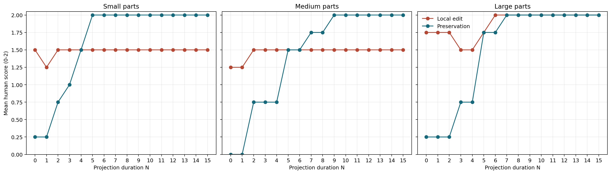

The per-case heatmaps expose transitions that are hidden by the mean. Most cases retain or improve local-edit scores as preservation increases. `real_0010` (`head -> dragon`) is the only case with local-edit score 0 for every duration `N=0..15`; its preservation improves to 2, but the requested dragon-head semantics never appear. This is a target-generation failure rather than a preservation failure.

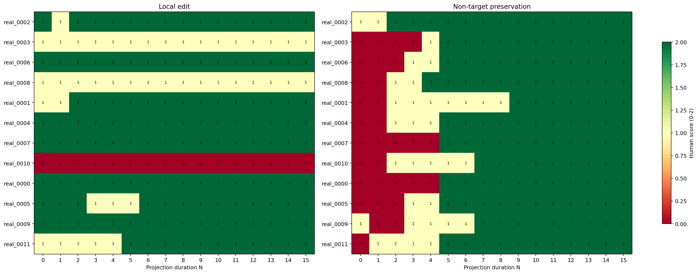

## Qualitative Results Across All N

The six panels cover every case and every duration. Each row includes the source, GT part, Original FYS-TDM baseline, and one contiguous half of the residual sweep. Splitting `N=0..7` and `N=8..15` keeps the images readable without dropping any duration.

### Small parts

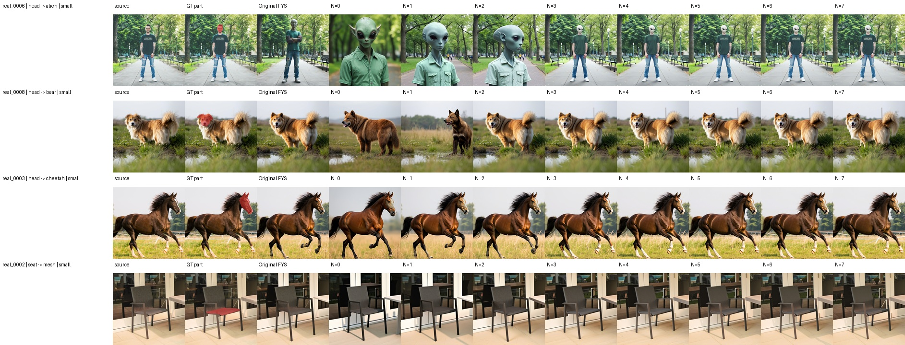

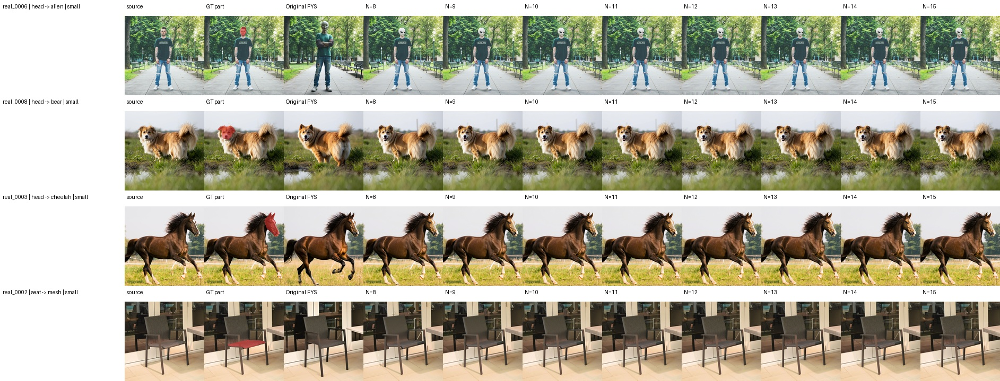

### Medium parts

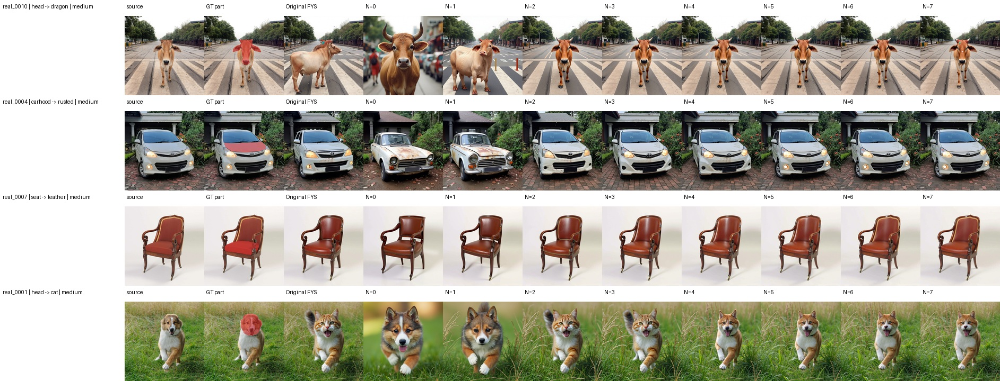

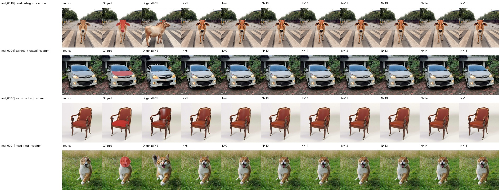

### Large parts

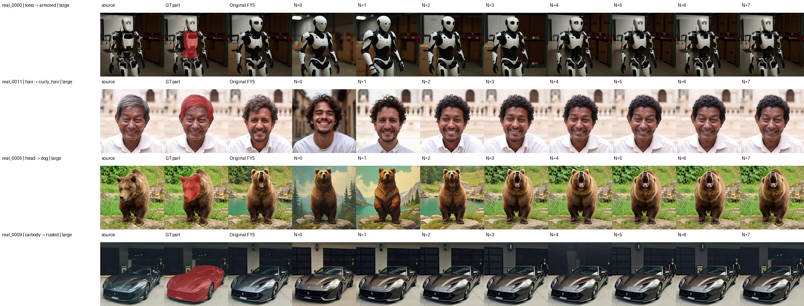

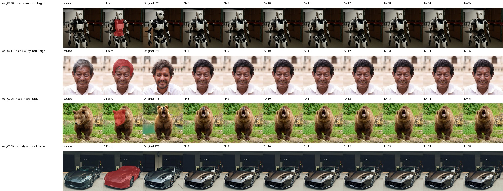

## Operating Points

- **Earliest successful prefix, `N=5`:** first maximum joint-success rate, with the shortest successful control duration.
- **Balanced global setting, `N=7`:** first maximum mean local-edit score with preservation already above 1.9/2.
- **Preservation-first setting, `N=9`:** beginning of the maximum-preservation plateau without reducing aggregate semantic success.

For a single frozen setting, `N=7` is the primary result. `N=5` and `N=9` remain protocol-level ablations, not per-case choices.

## Interpretation

1. Residual RK2 changes the edit-preservation trade-off smoothly across the complete prefix sweep rather than producing an isolated improvement at one selected duration.
2. Midpoint-consistent source referencing strongly reduces non-target drift while retaining target-prompt semantics in 11 of 12 cases.
3. Pixel preservation alone remains insufficient: the persistent `head -> dragon` failure shows that control cannot recover semantics absent from the target trajectory.
4. Original FYS-TDM remains a shared baseline, but comparison with other oracle control operations is kept in `final_note.md` so this report can focus on the Residual RK2 mechanism itself.
5. The result validates an oracle-mask control operation, not an automatic localization estimator.

## Limitations

- The pilot has 12 cases and one human reviewer.
- The oracle mask removes localization uncertainty and therefore cannot establish automatic part localization.
- The inversion-based path is deterministic; seed labels do not provide independent uncertainty estimates.
- Global SSIM is the repository's selected-pixel proxy rather than windowed SSIM.
- Outside LPIPS neutralizes the GT interior to match the established project protocol.

## Result Artifacts

- `core/results/control_operations/residual_rk2_prefix_sweep/`: 192 images, plans, logs, configurations, and traces.
- `core/results/run_matrices/residual_rk2_prefix_all_cases_n0_n15.csv`: exact command matrix.
- `core/results/control_operations_eval/residual_rk2_prefix_sweep/unified_image_metrics.csv`: unified automatic metrics.
- `core/results/control_operations_eval/residual_rk2_prefix_sweep/manual_review_scores.csv`: completed ratings for all 192 outputs.
- `core/notebooks/10_evaluate_residual_rk2_prefix_sweep.ipynb`: executable full-duration analysis.

## Reproduction

Run the complete GPU sweep:

```bash
python core/scripts/run_residual_rk2_prefix_sweep.py \
  --manifest core/data/partedit_subset/pilot_12_manifest.json \
  --all-cases --durations 0-15 --seed 0 --execute
```

Compute all metrics and create the scoring page:

```bash
python core/scripts/evaluate_residual_rk2_prefix_sweep.py --lpips require
python core/scripts/build_residual_rk2_manual_review.py
```

After scoring, validate the CSV and execute Notebook 10:

```bash
python core/scripts/build_residual_rk2_manual_review.py \
  --validate core/results/control_operations_eval/residual_rk2_prefix_sweep/manual_review_scores.csv
python -m jupyter nbconvert --execute --to notebook --inplace \
  core/notebooks/10_evaluate_residual_rk2_prefix_sweep.ipynb
```
